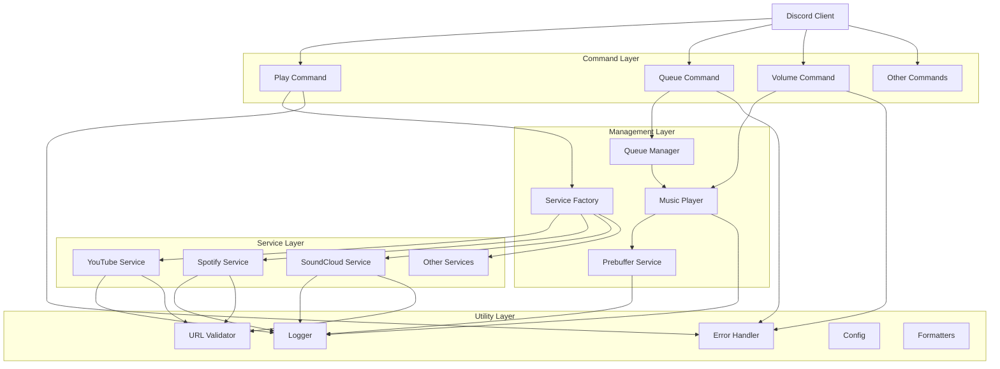
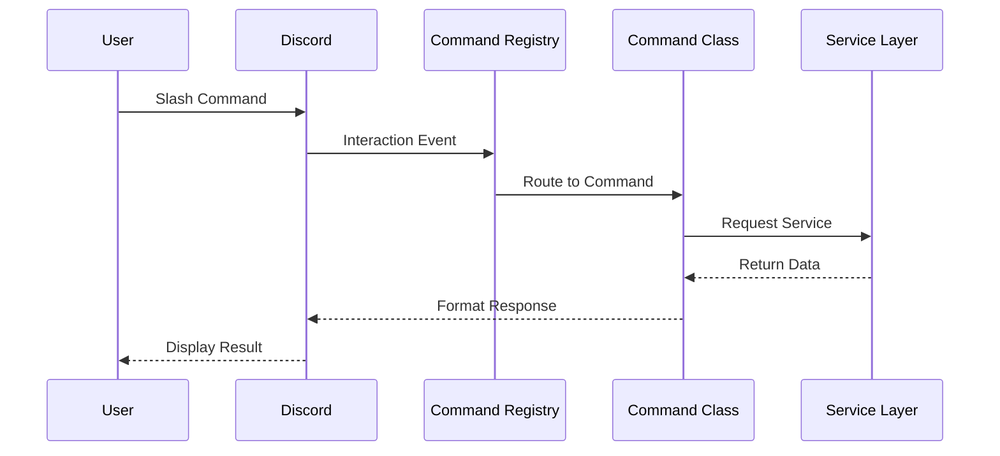
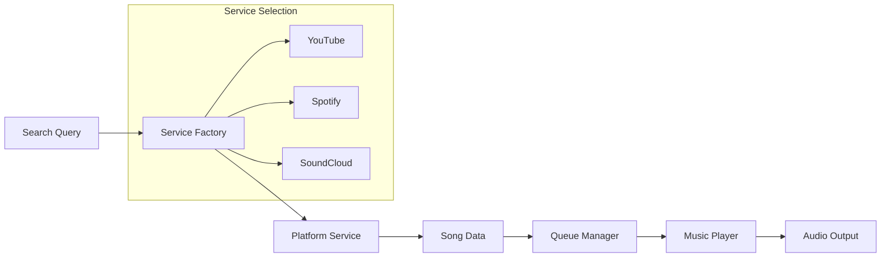
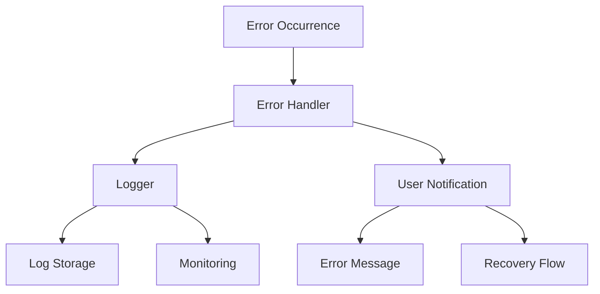

# Architecture Documentation

## Overview

Amber follows a modular, layered architecture with clear separation of concerns. The bot is designed with extensibility and maintainability in mind, using well-established design patterns and DRY principles.

## Core Architecture



## Key Components

### 1. AmberBot (Main Application)
- **Purpose**: Central orchestrator for the entire bot
- **Responsibilities**: 
  - Discord client management
  - Command registration and routing
  - Service initialization
  - Error handling and logging

### 2. Command Layer
- **Base Classes**:
  - `BaseCommandClass`: Core command functionality
  - `BaseMusicPlayerCommand`: Commands needing music player access
  - `BaseQueueCommand`: Commands needing queue access
- **Features**:
  - Automatic error handling
  - Response formatting
  - Permission checking
  - Dependency injection

### 3. Service Layer
- **Abstract Base**: `BaseMusicService`
- **Implementations**: YouTube, Spotify, SoundCloud services
- **Common Interface**: Unified `MusicService` interface
- **Factory Pattern**: `ServiceFactory` for service creation

### 4. Management Layer
- **QueueManager**: Per-guild queue management
- **MusicPlayer**: Audio playback and voice connections
- **ServiceFactory**: Service instance management
- **PrebufferService**: Background song preparation for instant playback

### 5. Utility Layer
- **Logger**: Centralized logging
- **ErrorHandler**: Consistent error management
- **Config**: Configuration management
- **Validators**: URL and input validation
- **Formatters**: String and time formatting

## Design Patterns

### 1. Abstract Factory Pattern
```typescript
class ServiceFactory {
  static getYouTubeService(): YouTubeService {
    if (!this.youtubeService) {
      this.youtubeService = new YouTubeService();
    }
    return this.youtubeService;
  }
  
  static getAllServices(): MusicService[] {
    return [
      this.getYouTubeService(),
      this.getSpotifyService(),
      this.getSoundCloudService()
    ];
  }
}
```

**Benefits**:
- Centralized service creation
- Lazy loading of services
- Easy addition of new platforms
- Consistent service interface

### 2. Template Method Pattern
```typescript
abstract class BaseCommandClass {
  abstract get data(): SlashCommandBuilder;
  abstract execute(interaction: ChatInputCommandInteraction): Promise<void>;
  
  protected async handleError(interaction: ChatInputCommandInteraction, error: Error) {
    // Common error handling logic
  }
}
```

**Benefits**:
- Consistent command structure
- Shared error handling
- Reduced boilerplate code

### 3. Strategy Pattern
```typescript
interface MusicService {
  search(query: string): Promise<Song[]>;
  getStreamUrl(song: Song): Promise<string>;
  validateUrl(url: string): boolean;
}
```

**Benefits**:
- Platform-specific implementations
- Runtime service selection
- Easy testing and mocking

### 4. Command Pattern
- Each Discord command encapsulated as a class
- Commands registered in `CommandRegistry`
- Uniform execution interface

## Data Flow

### 1. Command Execution Flow


### 2. Music Playback Flow


### 3. Error Handling Flow


## Extension Points

### Adding New Music Platforms

1. **Create Service Class**:
```typescript
export class NewPlatformService extends BaseMusicService {
  async search(query: string): Promise<Song[]> {
    // Implementation
  }
  
  async getStreamUrl(song: Song): Promise<string> {
    // Implementation
  }
  
  validateUrl(url: string): boolean {
    // Implementation
  }
}
```

2. **Update Service Factory**:
```typescript
static getNewPlatformService(): NewPlatformService {
  if (!this.newPlatformService) {
    this.newPlatformService = new NewPlatformService();
  }
  return this.newPlatformService;
}
```

3. **Add to Service List**:
```typescript
static getAllServices(): MusicService[] {
  return [
    this.getYouTubeService(),
    this.getSpotifyService(),
    this.getSoundCloudService(),
    this.getNewPlatformService() // Add here
  ];
}
```

### Adding New Commands

1. **Create Command Class**:
```typescript
export class NewCommand extends BaseCommandClass {
  get data(): SlashCommandBuilder {
    return new SlashCommandBuilder()
      .setName('newcommand')
      .setDescription('Description');
  }
  
  async execute(interaction: ChatInputCommandInteraction): Promise<void> {
    // Implementation
  }
}
```

2. **Register Command**:
```typescript
private setupCommands(): void {
  const commands = [
    new PlayCommand(this.queueManager, this.musicPlayer),
    // ... other commands
    new NewCommand() // Add here
  ];
  
  this.commandRegistry.registerMultiple(commands);
}
```

## DRY Compliance

### 1. Base Classes Eliminate Repetition
- **Commands**: Common patterns in base classes
- **Services**: Shared functionality in `BaseMusicService`
- **Error Handling**: Centralized error management

### 2. Utility Functions
- **URL Validation**: Reusable validation logic
- **Formatting**: Common string/time formatting
- **Configuration**: Single configuration source

### 3. Template Operations
- **Boolean Operations**: `executeBooleanOperation()` reduces boilerplate
- **Service Searches**: Common search patterns
- **Queue Operations**: Standardized queue methods

## Configuration Management

### Environment Variables
```typescript
export const config = {
  discord: {
    token: process.env.DISCORD_TOKEN!,
    clientId: process.env.DISCORD_CLIENT_ID!,
  },
  youtube: {
    apiKey: process.env.YOUTUBE_API_KEY,
  },
  spotify: {
    clientId: process.env.SPOTIFY_CLIENT_ID,
    clientSecret: process.env.SPOTIFY_CLIENT_SECRET,
  }
};
```

### Benefits
- Centralized configuration
- Environment-specific settings
- Easy deployment across environments
- Secure credential management

## Error Handling Strategy

### 1. Layered Error Handling
- **Command Level**: User-friendly error messages
- **Service Level**: Platform-specific error handling
- **Application Level**: Logging and monitoring

### 2. Error Types
- **User Errors**: Invalid input, permissions
- **Service Errors**: API failures, network issues
- **System Errors**: Configuration, resources

### 3. Recovery Mechanisms
- **Graceful Degradation**: Fallback services
- **Retry Logic**: Temporary failures
- **User Notification**: Clear error messages

## Performance Considerations

### 1. Lazy Loading
- Services created only when needed
- Commands initialized on startup
- Resources allocated on demand

### 2. Caching & Prebuffering
- Service instances cached in factory
- Configuration loaded once
- Reusable connections where possible
- **Smart Prebuffering**: Background preparation of next 1-2 songs for instant playback
- **LRU Cache**: 50-song cache with automatic cleanup for optimal memory usage

### 3. Async Operations
- Non-blocking service calls
- Concurrent command execution
- Efficient resource utilization
- **Parallel Search**: Multiple YouTube search strategies run simultaneously
- **Background Processing**: Prebuffering happens during current song playback

### 4. Search Optimization
- **3x Speed Improvement**: Parallel search strategies reduce latency
- **Timeout Protection**: 8-second timeout prevents hanging operations
- **Reduced API Calls**: Optimized from 10→5 search results, process top 3 in parallel

## Testing Strategy

### 1. Unit Tests
- Individual command testing
- Service method testing
- Utility function testing

### 2. Integration Tests
- Service integration testing
- Command flow testing
- Error scenario testing

### 3. Mocking
- Service mocking for tests
- Discord API mocking
- External service mocking

## Scalability Considerations

### 1. Guild Isolation
- Per-guild queues and state
- Independent guild operations
- Scalable queue management

### 2. Service Abstraction
- Platform-independent interfaces
- Easy service replacement
- Load balancing capabilities

### 3. Modular Design
- Independent component scaling
- Microservice migration path
- Distributed deployment ready

## Security Considerations

### 1. Input Validation
- URL validation before processing
- Command parameter validation
- User permission checking

### 2. Credential Management
- Environment variable storage
- No hardcoded secrets
- Secure API key handling

### 3. Error Information
- Sanitized error messages
- No sensitive data exposure
- Appropriate logging levels

This architecture provides a solid foundation for building a maintainable, extensible Discord music bot while following best practices and design patterns.