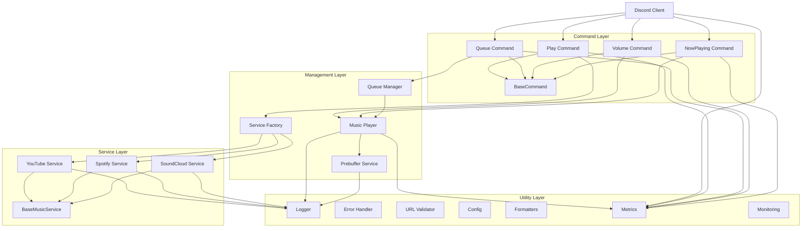
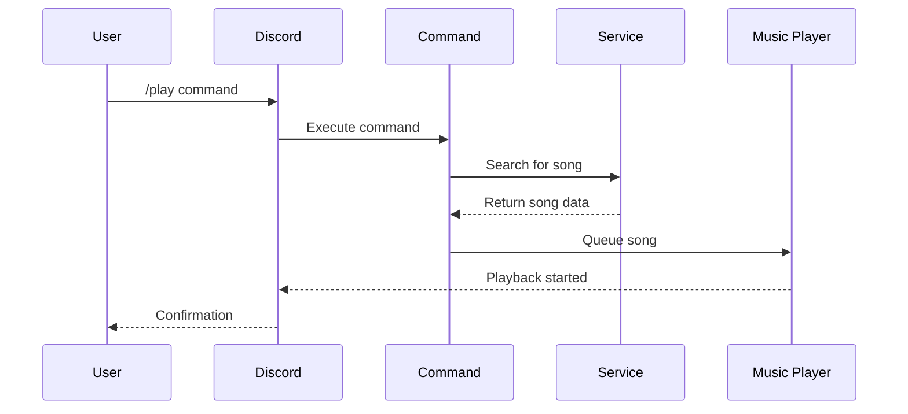

# Architecture Documentation

## Overview

Amber follows a simple, modular architecture with clear separation of concerns. The bot is designed with maintainability in mind, using straightforward patterns and minimal complexity.

## Core Architecture



## Key Components

### 1. Main Application (index.ts)
- **Purpose**: Entry point for the Discord bot
- **Responsibilities**: 
  - Discord client initialization
  - Command registration
  - Event handling
  - Sentry initialization via instrument.ts

### 2. Command Layer
- **Base Class**: `BaseCommand` - Simple shared functionality
- **Commands**: 9 total commands
  - `play.ts` - Play music from URL or search
  - `pause.ts` - Pause current playback
  - `resume.ts` - Resume paused playback
  - `stop.ts` - Stop playback and clear queue
  - `skip.ts` - Skip to next song
  - `volume.ts` - Adjust volume level
  - `queue.ts` - Display current queue
  - `nowplaying.ts` - Show current song info

### 3. Service Layer
- **Base Class**: `BaseMusicService` - Common service patterns
- **Services**: 
  - `youtubeService.ts` - YouTube integration
  - `spotifyService.ts` - Spotify integration
  - `soundcloudService.ts` - SoundCloud integration
- **Factory**: `ServiceFactory` - Simple service creation

### 4. Management Layer
- **QueueManager**: Basic queue operations
- **MusicPlayer**: Audio playback management
- **PrebufferService**: Background song preparation
- **ServiceFactory**: Service instance management

### 5. Utility Layer
- **Logger**: Basic logging functionality
- **ErrorHandler**: Enhanced error management with Sentry integration
- **Config**: Environment configuration
- **URLValidator**: URL validation
- **Formatters**: String formatting utilities
- **Metrics**: Prometheus metrics collection and reporting
- **Monitoring**: Health checks, Sentry error tracking, and observability
- **Instrument**: Sentry initialization and configuration

## Design Patterns

### 1. Factory Pattern
```typescript
class ServiceFactory {
  private static youtubeService: YouTubeService;
  private static spotifyService: SpotifyService;
  private static soundcloudService: SoundCloudService;
  
  static getYouTubeService(): YouTubeService {
    if (!this.youtubeService) {
      this.youtubeService = new YouTubeService();
    }
    return this.youtubeService;
  }
}
```

### 2. Template Method Pattern
```typescript
abstract class BaseCommand {
  abstract get data(): SlashCommandBuilder;
  abstract execute(interaction: ChatInputCommandInteraction): Promise<void>;
}
```

### 3. Strategy Pattern
- Platform-specific music service implementations
- Common interface for all music services
- Runtime service selection based on URL/platform

## Data Flow

### 1. Command Execution Flow


### 2. Music Playback Flow


## File Structure

```
src/
├── commands/              # Discord slash commands (9 files)
│   ├── baseCommand.ts    # Base command class with Sentry transaction support
│   ├── play.ts           # Play command
│   ├── pause.ts          # Pause command
│   ├── resume.ts         # Resume command
│   ├── stop.ts           # Stop command
│   ├── skip.ts           # Skip command
│   ├── volume.ts         # Volume command
│   ├── queue.ts          # Queue command
│   └── nowplaying.ts     # Now playing command
├── services/             # Music platform services
│   ├── baseMusicService.ts    # Base service class
│   ├── youtubeService.ts      # YouTube integration
│   ├── spotifyService.ts      # Spotify integration
│   ├── soundcloudService.ts   # SoundCloud integration
│   ├── musicPlayer.ts         # Audio playback
│   ├── queueManager.ts        # Queue management
│   ├── prebufferService.ts    # Prebuffering optimization
│   └── serviceFactory.ts      # Service creation
├── utils/                # Utility functions
│   ├── commandRegistry.ts     # Command registration
│   ├── config.ts             # Configuration
│   ├── errorHandler.ts       # Error handling with Sentry integration
│   ├── logger.ts             # Logging
│   ├── urlValidator.ts       # URL validation
│   ├── formatters.ts         # String formatting
│   ├── metrics.ts            # Prometheus metrics collection
│   └── monitoring.ts         # Health checks, Sentry, and observability
├── types/                # TypeScript types
│   └── index.ts             # Type definitions
├── instrument.ts         # Sentry initialization and configuration
└── index.ts              # Main entry point
```

## Extension Points

### Adding New Music Platforms

1. **Create Service Class**:
```typescript
export class NewPlatformService extends BaseMusicService {
  async search(query: string): Promise<Song[]> {
    // Implementation
  }
  
  async getStreamUrl(song: Song): Promise<string> {
    // Implementation
  }
  
  validateUrl(url: string): boolean {
    // Implementation
  }
}
```

2. **Update Service Factory**:
```typescript
static getNewPlatformService(): NewPlatformService {
  if (!this.newPlatformService) {
    this.newPlatformService = new NewPlatformService();
  }
  return this.newPlatformService;
}
```

### Adding New Commands

1. **Create Command Class**:
```typescript
export class NewCommand extends BaseCommand {
  get data(): SlashCommandBuilder {
    return new SlashCommandBuilder()
      .setName('newcommand')
      .setDescription('Description');
  }
  
  async execute(interaction: ChatInputCommandInteraction): Promise<void> {
    // Implementation
  }
}
```

2. **Register in CommandRegistry**:
```typescript
// Add to command registration system
```

## Configuration Management

### Environment Variables
```typescript
export const config = {
  discord: {
    token: process.env.DISCORD_TOKEN!,
    clientId: process.env.DISCORD_CLIENT_ID!,
  },
  youtube: {
    apiKey: process.env.YOUTUBE_API_KEY,
  },
  spotify: {
    clientId: process.env.SPOTIFY_CLIENT_ID,
    clientSecret: process.env.SPOTIFY_CLIENT_SECRET,
  },
  soundcloud: {
    clientId: process.env.SOUNDCLOUD_CLIENT_ID,
  },
  bot: {
    maxQueueSize: parseInt(process.env.MAX_QUEUE_SIZE || '100'),
    defaultVolume: parseFloat(process.env.DEFAULT_VOLUME || '0.5'),
    autoLeaveTimeout: parseInt(process.env.AUTO_LEAVE_TIMEOUT || '300000'),
  },
  monitoring: {
    prometheusPort: parseInt(process.env.PROMETHEUS_PORT || '5150'),
    sentryDsn: process.env.SENTRY_DSN,
    sentryEnvironment: process.env.SENTRY_ENVIRONMENT || 'production',
    elkHost: process.env.ELK_HOST,
    elkPort: parseInt(process.env.ELK_PORT || '8080'),
  }
};
```

## Performance Features

### 1. Prebuffering System
- **Smart Prebuffering**: Next 1-2 songs prepared in background
- **LRU Cache**: 50-song cache with automatic cleanup
- **Spotify Optimization**: Prioritizes expensive Spotify conversions

### 2. Search Optimization
- **Intelligent Search**: YouTube searches prioritize official channels
- **Parallel Processing**: Multiple search strategies run simultaneously
- **Timeout Protection**: 8-second timeout prevents hanging operations

### 3. Resource Management
- **Memory Limits**: Docker container limited to 512MB
- **CPU Limits**: 0.5 CPU cores maximum
- **Auto-cleanup**: Automatic cache cleanup and resource management

## Error Handling

### 1. Layered Error Handling
- **Command Level**: User-friendly error messages
- **Service Level**: Platform-specific error handling
- **Application Level**: Logging and monitoring

### 2. Recovery Mechanisms
- **Graceful Degradation**: Fallback between services
- **Retry Logic**: Handles temporary failures
- **User Notification**: Clear error messages to users

## Security Considerations

### 1. Input Validation
- URL validation before processing
- Command parameter validation
- User permission checking

### 2. Credential Management
- Environment variable storage
- No hardcoded secrets
- Secure API key handling

### 3. Container Security
- Non-root user in Docker
- Resource limits enforced
- No sensitive data in logs

## Deployment Architecture

### Kubernetes Deployment
```
k8s/
├── configmap.yaml         # Environment configuration
├── deployment.yaml        # Main application deployment
├── service.yaml          # LoadBalancer service
├── filebeat-sidecar.yaml # ELK log shipping
├── namespace.yaml        # Namespace definition
└── deploy.sh            # Automated deployment script
```

### Deployment Features
- **ConfigMap Integration**: Centralized environment variable management
- **Sidecar Logging**: Filebeat container for log aggregation to ELK stack
- **Health Probes**: Liveness and readiness checks for container health
- **Resource Limits**: CPU and memory constraints for optimal resource usage
- **Service Discovery**: LoadBalancer service for external access to metrics
- **Automated Scripts**: `deploy.sh` for streamlined deployment process

### Monitoring & Observability
- **Sentry Integration**: Full transaction tracking with 100% capture rate
- **Prometheus Metrics**: Performance and operational metrics collection
- **ELK Stack Logging**: Centralized log aggregation and analysis
- **Health Endpoints**: `/health` and `/metrics` endpoints for monitoring

This architecture provides a solid foundation for a maintainable Discord music bot with production-ready deployment capabilities and comprehensive observability.