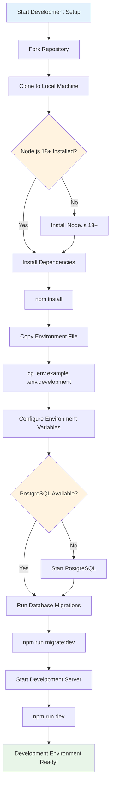
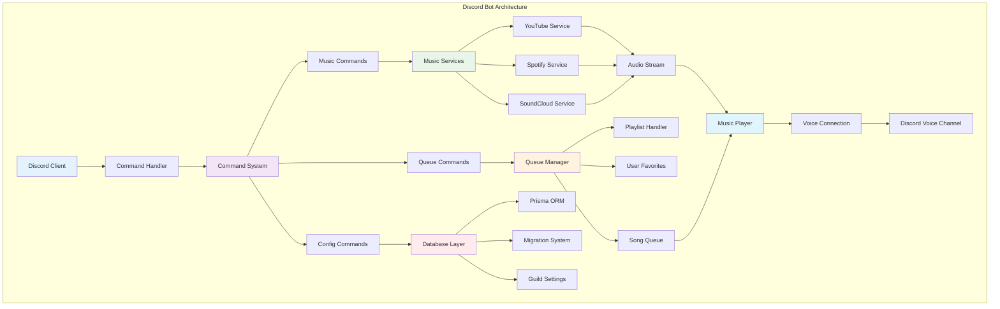
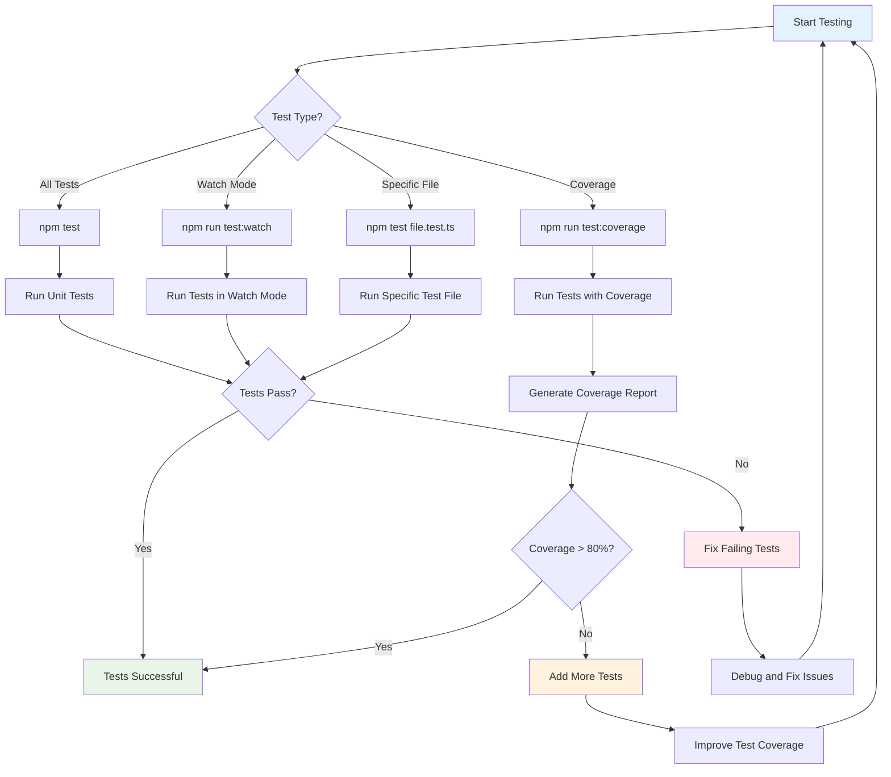
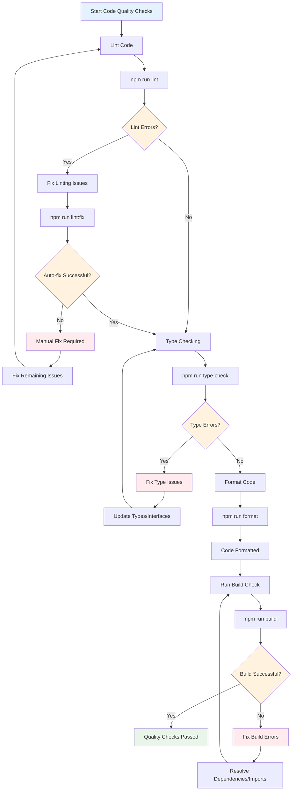
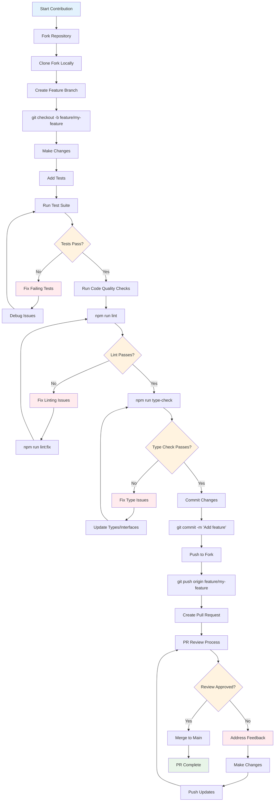
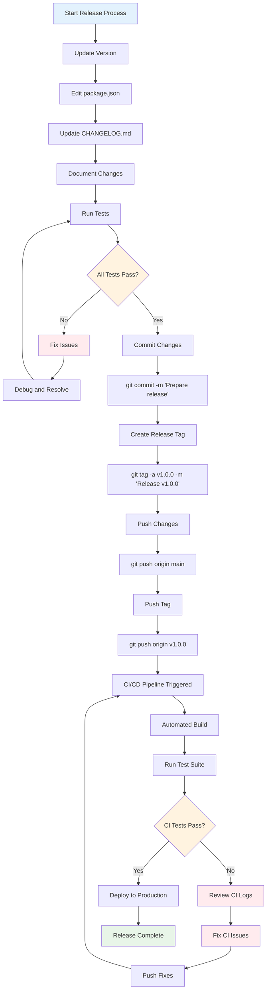

# Development Guide

## Getting Started

### Prerequisites

- Node.js 20+ (latest LTS recommended)
- npm or yarn
- Git
- Discord Bot Token (for testing)
- Music Service API Keys (YouTube, Spotify, SoundCloud optional)
- Sentry DSN (optional, for error tracking and performance monitoring)
- Docker (optional, for containerized development)
- Kubernetes (optional, for k8s deployment)

### Development Setup



#### Step-by-Step Instructions

1. **Fork and Clone**
   ```bash
   git clone https://github.com/your-username/amber.git
   cd amber
   ```

2. **Install Dependencies**
   ```bash
   npm install
   ```

3. **Environment Setup**
   ```bash
   cp .env.example .env.development
   ```

4. **Database Setup (Planned Feature)**
   ```bash
   # Note: Database support is planned for a future release
   # The following commands will be available once implemented:
   
   # Start PostgreSQL
   npm run db:start
   
   # Run migrations
   npm run migrate:dev
   ```

5. **Start Development**
   ```bash
   npm run dev
   ```

## Project Structure

```mermaid
graph TD
    A[Amber Project] --> B[src/]
    A --> C[test/]
    A --> D[wiki/]
    A --> E[scripts/]
    A --> F[data/]
    A --> G[k8s/]
    
    B --> B1[commands/]
    B --> B2[services/]
    B --> B3[types/]
    B --> B4[utils/]
    B --> B5[index.ts]
    B --> B6[instrument.ts]
    
    B1 --> B1a[baseCommand.ts]
    B1 --> B1b[play.ts]
    B1 --> B1c[pause.ts]
    B1 --> B1d[queue.ts]
    B1 --> B1e[volume.ts]
    B1 --> B1f[... other commands]
    
    B2 --> B2a[musicPlayer.ts]
    B2 --> B2b[queueManager.ts]
    B2 --> B2c[serviceFactory.ts]
    B2 --> B2d[youtubeService.ts]
    B2 --> B2e[spotifyService.ts]
    B2 --> B2f[soundcloudService.ts]
    B2 --> B2g[prebufferService.ts]
    
    B3 --> B3a[index.ts]
    
    B4 --> B4a[commandRegistry.ts]
    B4 --> B4b[config.ts]
    B4 --> B4c[logger.ts]
    B4 --> B4d[errorHandler.ts]
    B4 --> B4e[formatters.ts]
    B4 --> B4f[metrics.ts]
    B4 --> B4g[monitoring.ts]
    
    C --> C1[commands/]
    C --> C2[services/]
    C --> C3[utils/]
    C --> C4[setup.ts]
    
    D --> D1[Development/]
    D --> D2[Getting Started/]
    D --> D3[Using AMBER/]
    
    G --> G1[configmap.yaml]
    G --> G2[deployment.yaml]
    G --> G3[service.yaml]
    G --> G4[filebeat-sidecar.yaml]
    G --> G5[deploy.sh]
    
    style A fill:#e1f5fe
    style B fill:#f3e5f5
    style C fill:#e8f5e8
    style D fill:#fff3e0
    style G fill:#e1f5fe
```



## Architecture



### Core Components

1. **Command System**
   - Base command interface
   - Slash command registration
   - Permission handling

2. **Music Services**
   - YouTube integration
   - Spotify integration
   - SoundCloud integration
   - Audio streaming

3. **Queue Management**
   - Song queue operations
   - Playlist handling
   - User favorites (planned)

4. **Database Layer (Planned Feature)**
   - Prisma ORM
   - Migration system
   - Guild settings

## Development Workflow

### Running Tests



#### Testing Commands

```bash
# Run all tests
npm test

# Run tests in watch mode
npm run test:watch

# Run tests with coverage
npm run test:coverage

# Run specific test file
npm test commands/play.test.ts
```

### Code Quality



#### Code Quality Commands

```bash
# Lint code
npm run lint

# Fix linting issues
npm run lint:fix

# Type checking
npm run type-check

# Format code
npm run format
```

### Building

```bash
# Build for production
npm run build

# Build and watch for changes
npm run build:watch
```

## Creating Commands

### Basic Command Structure

```typescript
import { BaseCommand } from './baseCommand';
import { CommandInteraction, SlashCommandBuilder } from 'discord.js';

export class MyCommand extends BaseCommand {
  constructor() {
    super();
    this.data = new SlashCommandBuilder()
      .setName('mycommand')
      .setDescription('My custom command');
  }

  async execute(interaction: CommandInteraction): Promise<void> {
    await interaction.reply('Hello from my command!');
  }
}
```

### Adding Options

```typescript
this.data = new SlashCommandBuilder()
  .setName('mycommand')
  .setDescription('My custom command')
  .addStringOption(option =>
    option.setName('input')
      .setDescription('Input parameter')
      .setRequired(true)
  );
```

## Adding Music Services

### Service Interface

```typescript
export interface MusicService {
  search(query: string): Promise<Song[]>;
  getStream(song: Song): Promise<AudioResource>;
  validateUrl(url: string): boolean;
}
```

### Implementation Example

```typescript
export class MyMusicService implements MusicService {
  async search(query: string): Promise<Song[]> {
    // Implementation
  }

  async getStream(song: Song): Promise<AudioResource> {
    // Implementation
  }

  validateUrl(url: string): boolean {
    // Implementation
  }
}
```

## Database Operations (Planned Feature)

> **Note:** Database support with Prisma ORM is planned for a future release. The following examples show the intended implementation.

### Using Prisma

```typescript
import { PrismaClient } from '@prisma/client';

const prisma = new PrismaClient();

// Create a new record
const user = await prisma.user.create({
  data: {
    discordId: '123456789',
    settings: {
      volume: 50,
      autoAnnounce: true
    }
  }
});

// Find records
const users = await prisma.user.findMany({
  where: {
    guildId: '987654321'
  }
});
```

### Creating Migrations

> **Note:** These commands will be available once database support is implemented.

```bash
# Create a new migration
npx prisma migrate dev --name add_new_feature

# Reset database
npx prisma migrate reset

# Deploy to production
npx prisma migrate deploy
```

## Testing

### Unit Tests

```typescript
import { MyCommand } from '../commands/myCommand';
import { createMockInteraction } from '../test/helpers';

describe('MyCommand', () => {
  let command: MyCommand;
  let interaction: CommandInteraction;

  beforeEach(() => {
    command = new MyCommand();
    interaction = createMockInteraction();
  });

  it('should execute successfully', async () => {
    await command.execute(interaction);
    expect(interaction.reply).toHaveBeenCalledWith('Hello from my command!');
  });
});
```

### Integration Tests

```typescript
import { setupTestDatabase, cleanupTestDatabase } from '../test/database';
import { createTestBot } from '../test/bot';

describe('Music Integration', () => {
  beforeAll(async () => {
    await setupTestDatabase();
  });

  afterAll(async () => {
    await cleanupTestDatabase();
  });

  it('should play music successfully', async () => {
    const bot = await createTestBot();
    // Test implementation
  });
});
```

## Debugging

### Debug Configuration

```typescript
// Enable debug logging
process.env.LOG_LEVEL = 'debug';

// Enable Discord.js debug
process.env.DEBUG = 'discord.js:*';
```

### VSCode Debug Configuration

```json
{
  "type": "node",
  "request": "launch",
  "name": "Debug Amber",
  "program": "${workspaceFolder}/src/index.ts",
  "outFiles": ["${workspaceFolder}/dist/**/*.js"],
  "envFile": "${workspaceFolder}/.env.development"
}
```

## Contributing

### Pull Request Process



#### Step-by-Step Instructions

1. **Fork the repository**
2. **Create a feature branch**
   ```bash
   git checkout -b feature/my-new-feature
   ```
3. **Make your changes**
4. **Add tests** for new functionality
5. **Run the test suite**
   ```bash
   npm test
   ```
6. **Commit your changes**
   ```bash
   git commit -m "Add my new feature"
   ```
7. **Push to your fork**
   ```bash
   git push origin feature/my-new-feature
   ```
8. **Create a Pull Request**

### Code Style

- Use TypeScript for all new code
- Follow existing naming conventions
- Add JSDoc comments for public APIs
- Use async/await over Promises
- Handle errors appropriately

### Commit Messages

- Use conventional commits format
- Start with a verb (Add, Fix, Update, etc.)
- Keep first line under 72 characters
- Include issue number if applicable

Examples:
```
Add support for playlist shuffle
Fix memory leak in queue manager
Update YouTube API integration
```

## Release Process



#### Release Steps

1. **Update version** in `package.json`
2. **Update CHANGELOG.md**
3. **Create release tag**
   ```bash
   git tag -a v1.0.0 -m "Release v1.0.0"
   ```
4. **Push tag**
   ```bash
   git push origin v1.0.0
   ```
5. **CI/CD will handle the rest**

## Deployment

### Docker Deployment

```bash
# Build Docker image
docker build -t amber-bot .

# Run with Docker Compose
docker-compose up -d

# View logs
docker-compose logs -f
```

### Kubernetes Deployment

```bash
# Deploy to Kubernetes
cd k8s
./deploy.sh

# Check deployment status
kubectl get pods -n amber

# View logs
kubectl logs -f deployment/amber -n amber
```

### Monitoring Setup

#### Sentry Configuration

```typescript
// Automatically initialized via instrument.ts
// Environment variables:
// SENTRY_DSN=your-sentry-dsn
// SENTRY_ENVIRONMENT=production
```

#### Prometheus Metrics

```bash
# Metrics available at http://localhost:5150/metrics
# Configure Prometheus to scrape this endpoint
```

#### ELK Stack Integration

```yaml
# Filebeat sidecar automatically ships logs to ELK
# Configure ELK_HOST and ELK_PORT in environment
```

## Resources

- [Discord.js Documentation](https://discord.js.org/)
- [Prisma Documentation](https://www.prisma.io/docs/)
- [TypeScript Handbook](https://www.typescriptlang.org/docs/)
- [Jest Testing Framework](https://jestjs.io/docs/getting-started)
- [Sentry Documentation](https://docs.sentry.io/)
- [Kubernetes Documentation](https://kubernetes.io/docs/)