# Testing & CI/CD Pipeline Documentation

## 🚀 Pipeline Overview

This project uses a **fail-fast** CI/CD pipeline optimized for developer productivity and resource efficiency. The pipeline is structured to catch issues early and provide quick feedback.

## 📋 Pipeline Flow

```mermaid
graph TD
    A[📦 build] --> B[🔍 lint]
    A --> C[🔍 security_scan]
    B --> D[🧪 test]
    C --> D
    B --> E[🐳 build_docker]
    C --> E
    D --> F[📊 sonar_scan]
    B --> F
```



## ✅ Pipeline Stages

### 1. **Build Stage** 🏗️
- **Duration**: ~1-2 minutes
- **Purpose**: Compile TypeScript and install dependencies
- **Jobs**:
  - `build` - Compiles TypeScript, installs node_modules, creates artifacts

### 2. **Lint Stage** ⚡ (Fast Quality Checks)
- **Duration**: ~30 seconds
- **Purpose**: Quick code quality and security validation
- **Jobs**:
  - `lint` - ESLint code style and quality checks
  - `security_scan` - npm audit for known vulnerabilities
- **Runs in parallel** for maximum speed

### 3. **Test Stage** 🧪 (Comprehensive Validation)
- **Duration**: ~2-5 minutes
- **Purpose**: Full testing and deployment preparation
- **Jobs**:
  - `test` - Jest unit tests with coverage reports
  - `build_docker` - Docker image building and registry push
  - `sonar_scan` - SonarQube code quality analysis
- **Runs in parallel** after lint stage passes

## 🎯 Benefits

| Benefit | Description |
|---------|-------------|
| **⚡ Fail Fast** | Lint errors caught in ~30 seconds, not 5+ minutes |
| **💰 Save Resources** | Don't run expensive tests if code style is broken |
| **🔒 Quality Gates** | Docker images only built if lint passes |
| **⏱️ Better Feedback** | Developers get style feedback immediately |
| **🏗️ Industry Standard** | Follows CI/CD best practices |

## 📊 Execution Order

```
1. build (compile code)
     ↓
2. lint + security_scan (quick quality checks - run in parallel)
     ↓ (only if lint passes)
3. test + build_docker + sonar_scan (expensive operations - run in parallel)
```

## 🧪 Local Development Testing

### Prerequisites
```bash
npm install
```

### Running Tests Locally

#### 1. **Linting**
```bash
# Run ESLint
npm run lint

# Fix auto-fixable issues
npm run lint:fix
```

#### 2. **Unit Tests**
```bash
# Run tests once
npm test

# Run tests in watch mode
npm run test:watch

# Run tests with coverage
npm run test:coverage

# Run tests in CI mode (same as pipeline)
npm run test:ci
```

#### 3. **Build**
```bash
# Compile TypeScript
npm run build

# Start the application
npm start

# Development mode with auto-reload
npm run dev
```

#### 4. **Security Scanning**
```bash
# Check for security vulnerabilities
npm audit

# Fix vulnerabilities (if possible)
npm audit fix
```

## 🐳 Docker Testing

### Build Docker Image Locally
```bash
# Build the image
docker build -t amber-discord-bot .

# Run the container
docker run -d --name amber-bot \
  -e DISCORD_TOKEN=your_token \
  -e SPOTIFY_CLIENT_ID=your_id \
  -e SPOTIFY_CLIENT_SECRET=your_secret \
  amber-discord-bot
```

### Docker Compose (Development)
```bash
# Start services
docker-compose up -d

# View logs
docker-compose logs -f

# Stop services
docker-compose down
```

## 📈 Coverage Requirements

- **Minimum Coverage**: 80%
- **Coverage Reports**: Generated in `coverage/` directory
- **Coverage Formats**: 
  - HTML report: `coverage/lcov-report/index.html`
  - Cobertura XML: `coverage/cobertura-coverage.xml`
  - LCOV format: `coverage/lcov.info`

## 🔧 Pipeline Configuration

### Required GitLab CI/CD Variables

#### 1. **SonarQube Configuration** (Optional but Recommended)
```yaml
SONAR_HOST_URL
SONAR_TOKEN
```
- **SONAR_HOST_URL**: URL of your SonarQube server
  - **Example**: `http://your-sonar-server.com:9000` or `https://sonarcloud.io`
- **SONAR_TOKEN**: Authentication token for SonarQube
  - **How to create**: 
    1. Log into SonarQube → My Account → Security → Tokens
    2. Generate token with name "GitLab CI"
    3. Copy token immediately (you won't see it again)
- **Required for**: `sonar_scan` job
- **Note**: If not set, SonarQube analysis will be skipped gracefully

#### 2. **Docker Registry Variables** (Auto-provided by GitLab)
These are **automatically provided** by GitLab, no setup needed:
```yaml
CI_REGISTRY          # your-gitlab-domain.com:5050 (automatically set)
CI_REGISTRY_USER     # Auto-generated
CI_REGISTRY_PASSWORD # Auto-generated  
CI_REGISTRY_IMAGE    # Full image path
```

#### 3. **Application Environment Variables** (For Runtime)
Your Discord bot will need these when deployed:
```yaml
DISCORD_TOKEN         # Your Discord bot token
SPOTIFY_CLIENT_ID     # Spotify API client ID
SPOTIFY_CLIENT_SECRET # Spotify API client secret
```

### 🖥️ How to Set Them Up in GitLab

#### **Step 1: Access CI/CD Settings**
1. Go to your project in GitLab
2. Navigate to **Settings** → **CI/CD**
3. Expand the **Variables** section

#### **Step 2: Add Variables**
Click **Add variable** for each one:

| Variable | Value | Protected | Masked | Scope |
|----------|-------|-----------|--------|-------|
| `SONAR_HOST_URL` | `http://your-sonar-server:9000` | ❌ | ❌ | All |
| `SONAR_TOKEN` | `squ_your_sonar_token` | ✅ | ✅ | All |
| `DISCORD_TOKEN` | `your_discord_bot_token` | ✅ | ✅ | All |
| `SPOTIFY_CLIENT_ID` | `your_spotify_client_id` | ✅ | ❌ | All |
| `SPOTIFY_CLIENT_SECRET` | `your_spotify_client_secret` | ✅ | ✅ | All |

#### **Step 3: Variable Settings**
- **Protected**: ✅ Only available in protected branches (main/master)
- **Masked**: ✅ Hides value in job logs (for secrets)
- **Scope**: Use "All environments" unless you have specific env needs

### 🚨 Currently Required vs Optional

#### **✅ Currently Required for Pipeline to Work**
- **None!** - Your pipeline will run without any manual variables
- Docker registry variables are auto-provided
- SonarQube gracefully skips if URL not set

#### **🔧 Required for Full Functionality**
```yaml
# For SonarQube code analysis
SONAR_HOST_URL=http://your-sonar-server:9000
SONAR_TOKEN=squ_your_sonar_token

# For actual bot deployment (not CI, but runtime)
DISCORD_TOKEN=your_token_here
SPOTIFY_CLIENT_ID=your_id_here  
SPOTIFY_CLIENT_SECRET=your_secret_here
```

### 💡 Pro Tips

#### **Security Best Practices**
```yaml
# ✅ Good - Masked and protected
DISCORD_TOKEN (masked=true, protected=true)

# ❌ Bad - Exposed in logs  
DISCORD_TOKEN (masked=false)
```

#### **Environment-Specific Variables**
You can set different values for different environments:
- **Development**: `DISCORD_TOKEN_DEV`
- **Production**: `DISCORD_TOKEN` (protected branches only)

#### **Testing Your Setup**
Add a debug job to verify variables:
```yaml
debug_vars:
  script:
    - echo "Registry: $CI_REGISTRY"
    - echo "SonarQube: $SONAR_HOST_URL"
    - echo "Discord token set: $([ -n "$DISCORD_TOKEN" ] && echo 'Yes' || echo 'No')"
```

### 🎯 Next Steps

1. **Immediate**: 
   - Set `SONAR_HOST_URL` if you have SonarQube
2. **Before Deployment**: Add Discord/Spotify tokens
3. **Optional**: Add environment-specific variables as needed

Your pipeline will work without any variables, but adding `SONAR_HOST_URL` will enable code quality analysis! 🚀

### Artifact Dependencies
```yaml
build → lint → test → sonar_scan
build → lint → build_docker
build → security_scan → test
build → security_scan → build_docker
```

## 🚨 Troubleshooting

### Common Issues

#### Jest Not Found
- **Cause**: Missing build artifacts
- **Solution**: Ensure `dependencies: [build]` is set in job

#### Docker Build Fails
- **Cause**: Missing CA certificates or TLS issues
- **Solution**: Check Docker daemon logs and CA certificate installation

#### SonarQube Connection Failed
- **Cause**: Invalid `SONAR_HOST_URL` or missing http:// scheme
- **Solution**: Verify URL format and server accessibility

#### Lint Failures
- **Cause**: Code style violations
- **Solution**: Run `npm run lint:fix` locally before pushing

### Pipeline Debugging

#### View Job Logs
1. Go to GitLab CI/CD → Pipelines
2. Click on failed pipeline
3. Click on failed job
4. Review logs for specific error messages

#### Artifact Inspection
- Download artifacts from successful jobs
- Check `node_modules/` and `dist/` contents
- Verify coverage reports in `coverage/` directory

## 📚 Additional Resources

- [GitLab CI/CD Documentation](https://docs.gitlab.com/ee/ci/)
- [Jest Testing Framework](https://jestjs.io/docs/getting-started)
- [ESLint Configuration](https://eslint.org/docs/user-guide/configuring)
- [SonarQube Analysis](https://docs.sonarqube.org/latest/)
- [Docker Best Practices](https://docs.docker.com/develop/dev-best-practices/)

## 📝 Contributing

When contributing to this project:

1. **Run tests locally** before pushing
2. **Fix lint issues** with `npm run lint:fix`
3. **Ensure coverage** doesn't drop below 80%
4. **Update tests** for new features
5. **Follow conventional commits** for better changelog generation

---

*Last updated: January 2025*
*Pipeline version: v1.0 (fail-fast optimized)* 