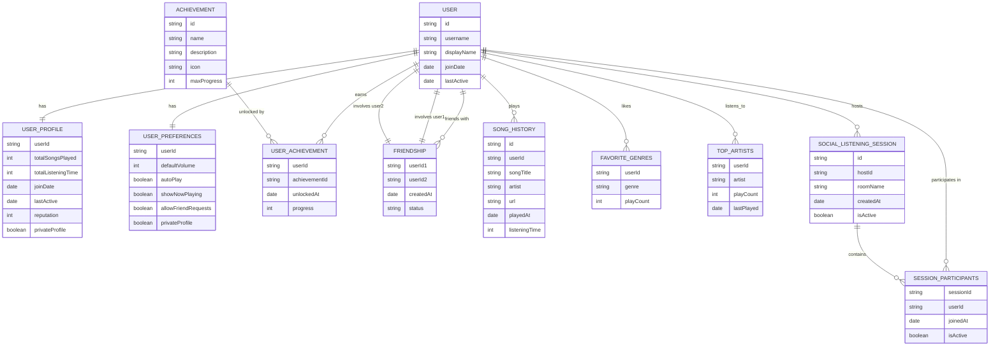

# Adding Features and Games

This guide shows how to extend Amber with new features and interactive games while maintaining the established architecture patterns.

## Feature Categories


### 1. Music Features
- Advanced queue management
- Playlist systems
- Audio effects and filters
- Lyrics display
- Music recommendations

### 2. Interactive Games
- Music quiz games
- Song guessing games
- Rhythm games
- Trivia challenges
- Leaderboards and scoring

### 3. Social Features
- User profiles and stats
- Song sharing and reviews
- Collaborative playlists
- Social listening sessions

### 4. Utility Features
- Music discovery
- Concert notifications
- Artist information
- Genre analytics

## Architecture for New Features

### 1. Feature Structure


**Traditional Structure View:**
```
src/
├── features/
│   ├── games/
│   │   ├── BaseGame.ts
│   │   ├── MusicQuizGame.ts
│   │   ├── GuessTheSongGame.ts
│   │   └── GameManager.ts
│   ├── playlists/
│   │   ├── PlaylistManager.ts
│   │   ├── PlaylistService.ts
│   │   └── PlaylistCommands.ts
│   └── social/
│       ├── UserProfile.ts
│       ├── SocialManager.ts
│       └── SocialCommands.ts
├── commands/
│   ├── games/
│   │   ├── StartQuizCommand.ts
│   │   └── GuessCommand.ts
│   └── features/
│       ├── PlaylistCommand.ts
│       └── ProfileCommand.ts
└── types/
    ├── games.ts
    ├── playlists.ts
    └── social.ts
```

## Creating Game Features

### 1. Base Game Class


```typescript
// src/features/games/BaseGame.ts
import { Guild, TextChannel, User } from 'discord.js';
import { Logger } from '../../utils/logger';

export interface GamePlayer {
  user: User;
  score: number;
  answers: string[];
  joinedAt: Date;
}

export interface GameState {
  id: string;
  guild: Guild;
  channel: TextChannel;
  players: Map<string, GamePlayer>;
  currentRound: number;
  maxRounds: number;
  isActive: boolean;
  startedAt: Date;
  settings: GameSettings;
}

export interface GameSettings {
  maxPlayers: number;
  roundTimeLimit: number;
  pointsPerCorrect: number;
  difficulty: 'easy' | 'medium' | 'hard';
}

export abstract class BaseGame {
  protected logger = new Logger('BaseGame');
  protected gameState: GameState;
  
  constructor(guild: Guild, channel: TextChannel, settings: Partial<GameSettings> = {}) {
    this.gameState = {
      id: this.generateGameId(),
      guild,
      channel,
      players: new Map(),
      currentRound: 0,
      maxRounds: 10,
      isActive: false,
      startedAt: new Date(),
      settings: {
        maxPlayers: 10,
        roundTimeLimit: 30000, // 30 seconds
        pointsPerCorrect: 100,
        difficulty: 'medium',
        ...settings
      }
    };
  }

  // Abstract methods that games must implement
  abstract startGame(): Promise<void>;
  abstract nextRound(): Promise<void>;
  abstract processAnswer(player: GamePlayer, answer: string): Promise<boolean>;
  abstract endGame(): Promise<void>;

  // Common game functionality
  async addPlayer(user: User): Promise<boolean> {
    if (this.gameState.players.size >= this.gameState.settings.maxPlayers) {
      return false;
    }

    if (this.gameState.players.has(user.id)) {
      return false;
    }

    const player: GamePlayer = {
      user,
      score: 0,
      answers: [],
      joinedAt: new Date()
    };

    this.gameState.players.set(user.id, player);
    this.logger.info(`Player ${user.username} joined game ${this.gameState.id}`);
    return true;
  }

  async removePlayer(userId: string): Promise<boolean> {
    const removed = this.gameState.players.delete(userId);
    if (removed) {
      this.logger.info(`Player ${userId} left game ${this.gameState.id}`);
    }
    return removed;
  }

  getLeaderboard(): GamePlayer[] {
    return Array.from(this.gameState.players.values())
      .sort((a, b) => b.score - a.score);
  }

  getGameInfo(): string {
    return `Game: ${this.gameState.id}\n` +
           `Players: ${this.gameState.players.size}/${this.gameState.settings.maxPlayers}\n` +
           `Round: ${this.gameState.currentRound}/${this.gameState.maxRounds}\n` +
           `Status: ${this.gameState.isActive ? 'Active' : 'Waiting'}`;
  }

  private generateGameId(): string {
    return `game_${Date.now()}_${Math.random().toString(36).substr(2, 9)}`;
  }
}
```

### 2. Music Quiz Game

```typescript
// src/features/games/MusicQuizGame.ts
import { BaseGame, GamePlayer, GameSettings } from './BaseGame';
import { Guild, TextChannel, EmbedBuilder } from 'discord.js';
import { ServiceFactory } from '../../services/serviceFactory';
import { Song } from '../../types';

interface QuizQuestion {
  song: Song;
  correctAnswer: string;
  options: string[];
  category: 'artist' | 'title' | 'year' | 'genre';
  hint?: string;
}

export class MusicQuizGame extends BaseGame {
  private questions: QuizQuestion[] = [];
  private currentQuestion: QuizQuestion | null = null;
  private roundTimer: NodeJS.Timeout | null = null;
  private answersReceived: Set<string> = new Set();

  constructor(guild: Guild, channel: TextChannel, settings: Partial<GameSettings> = {}) {
    super(guild, channel, settings);
  }

  async startGame(): Promise<void> {
    try {
      if (this.gameState.players.size < 2) {
        await this.gameState.channel.send('❌ Need at least 2 players to start the game!');
        return;
      }

      this.gameState.isActive = true;
      await this.generateQuestions();
      
      const embed = new EmbedBuilder()
        .setTitle('🎵 Music Quiz Started!')
        .setDescription(this.getGameInfo())
        .setColor('#00FF00')
        .addFields(
          { name: 'Players', value: Array.from(this.gameState.players.values()).map(p => p.user.username).join(', ') },
          { name: 'Rounds', value: this.gameState.maxRounds.toString() },
          { name: 'Time per Round', value: `${this.gameState.settings.roundTimeLimit / 1000}s` }
        );

      await this.gameState.channel.send({ embeds: [embed] });
      await this.nextRound();
      
    } catch (error) {
      this.logger.error('Error starting music quiz game:', error);
      await this.gameState.channel.send('❌ Error starting game. Please try again.');
    }
  }

  async nextRound(): Promise<void> {
    if (this.gameState.currentRound >= this.gameState.maxRounds) {
      await this.endGame();
      return;
    }

    this.gameState.currentRound++;
    this.answersReceived.clear();
    
    if (this.questions.length === 0) {
      await this.generateQuestions();
    }

    this.currentQuestion = this.questions.shift()!;
    
    const embed = new EmbedBuilder()
      .setTitle(`🎵 Round ${this.gameState.currentRound}/${this.gameState.maxRounds}`)
      .setDescription(this.formatQuestion(this.currentQuestion))
      .setColor('#FFA500')
      .setFooter({ text: `⏰ ${this.gameState.settings.roundTimeLimit / 1000} seconds to answer!` });

    await this.gameState.channel.send({ embeds: [embed] });
    
    // Start round timer
    this.roundTimer = setTimeout(async () => {
      await this.endRound();
    }, this.gameState.settings.roundTimeLimit);
  }

  async processAnswer(player: GamePlayer, answer: string): Promise<boolean> {
    if (!this.currentQuestion || this.answersReceived.has(player.user.id)) {
      return false;
    }

    this.answersReceived.add(player.user.id);
    player.answers.push(answer);

    const isCorrect = this.checkAnswer(answer, this.currentQuestion.correctAnswer);
    
    if (isCorrect) {
      player.score += this.gameState.settings.pointsPerCorrect;
      await this.gameState.channel.send(
        `✅ **${player.user.username}** got it right! (+${this.gameState.settings.pointsPerCorrect} points)`
      );
    }

    // If all players have answered or someone got it right, end the round
    if (this.answersReceived.size >= this.gameState.players.size || isCorrect) {
      if (this.roundTimer) {
        clearTimeout(this.roundTimer);
        this.roundTimer = null;
      }
      setTimeout(() => this.endRound(), 2000); // Show answer for 2 seconds
    }

    return isCorrect;
  }

  async endGame(): Promise<void> {
    this.gameState.isActive = false;
    
    const leaderboard = this.getLeaderboard();
    const embed = new EmbedBuilder()
      .setTitle('🏆 Game Over!')
      .setDescription('Final Results')
      .setColor('#FFD700');

    if (leaderboard.length > 0) {
      const winner = leaderboard[0];
      embed.addFields(
        { name: '🥇 Winner', value: `${winner.user.username} with ${winner.score} points!` },
        { 
          name: '📊 Leaderboard', 
          value: leaderboard.slice(0, 5).map((player, index) => 
            `${index + 1}. ${player.user.username}: ${player.score} points`
          ).join('\n') 
        }
      );
    }

    await this.gameState.channel.send({ embeds: [embed] });
    this.logger.info(`Music quiz game ${this.gameState.id} ended`);
  }

  private async generateQuestions(): Promise<void> {
    try {
      const genres = ['pop', 'rock', 'hip-hop', 'electronic', 'country', 'jazz'];
      const services = ServiceFactory.getAllServices();
      
      for (let i = 0; i < this.gameState.maxRounds; i++) {
        const genre = genres[Math.floor(Math.random() * genres.length)];
        const service = services[Math.floor(Math.random() * services.length)];
        
        const songs = await service.search(`${genre} popular songs`);
        if (songs.length > 0) {
          const song = songs[Math.floor(Math.random() * songs.length)];
          const question = await this.createQuestionFromSong(song);
          this.questions.push(question);
        }
      }
      
    } catch (error) {
      this.logger.error('Error generating quiz questions:', error);
    }
  }

  private async createQuestionFromSong(song: Song): Promise<QuizQuestion> {
    const categories: Array<'artist' | 'title' | 'year' | 'genre'> = ['artist', 'title'];
    const category = categories[Math.floor(Math.random() * categories.length)];
    
    let correctAnswer: string;
    let options: string[];
    
    switch (category) {
      case 'artist':
        correctAnswer = song.artist;
        options = await this.generateArtistOptions(song.artist);
        break;
      case 'title':
        correctAnswer = song.title;
        options = await this.generateTitleOptions(song.title);
        break;
      default:
        correctAnswer = song.artist;
        options = await this.generateArtistOptions(song.artist);
    }

    return {
      song,
      correctAnswer,
      options,
      category,
      hint: this.generateHint(song, category)
    };
  }

  private formatQuestion(question: QuizQuestion): string {
    const categoryText = question.category === 'artist' ? 'Who is the artist?' : 'What is the song title?';
    
    let questionText = `**${categoryText}**\n\n`;
    
    if (question.category === 'artist') {
      questionText += `🎵 Song: "${question.song.title}"\n\n`;
    } else {
      questionText += `🎤 Artist: ${question.song.artist}\n\n`;
    }

    questionText += '**Options:**\n';
    question.options.forEach((option, index) => {
      questionText += `${String.fromCharCode(65 + index)}. ${option}\n`;
    });

    if (question.hint) {
      questionText += `\n💡 Hint: ${question.hint}`;
    }

    return questionText;
  }

  private checkAnswer(answer: string, correctAnswer: string): boolean {
    const normalizedAnswer = answer.toLowerCase().trim();
    const normalizedCorrect = correctAnswer.toLowerCase().trim();
    
    // Check if answer matches option letter (A, B, C, D)
    if (normalizedAnswer.match(/^[a-d]$/)) {
      const optionIndex = normalizedAnswer.charCodeAt(0) - 97; // 'a' = 0, 'b' = 1, etc.
      return this.currentQuestion?.options[optionIndex]?.toLowerCase() === normalizedCorrect;
    }
    
    // Check direct text match
    return normalizedAnswer === normalizedCorrect;
  }

  private async endRound(): Promise<void> {
    if (!this.currentQuestion) return;

    const correctAnswer = this.currentQuestion.correctAnswer;
    const embed = new EmbedBuilder()
      .setTitle('⏰ Round Over!')
      .setDescription(`The correct answer was: **${correctAnswer}**`)
      .setColor('#FF6B6B')
      .addFields(
        { name: '🎵 Song', value: this.currentQuestion.song.title },
        { name: '🎤 Artist', value: this.currentQuestion.song.artist }
      );

    await this.gameState.channel.send({ embeds: [embed] });
    
    // Wait a moment before next round
    setTimeout(async () => {
      await this.nextRound();
    }, 3000);
  }

  private generateHint(song: Song, category: string): string {
    switch (category) {
      case 'artist':
        return `The artist's name starts with "${song.artist.charAt(0)}"`;
      case 'title':
        return `The song title has ${song.title.split(' ').length} words`;
      default:
        return 'Good luck!';
    }
  }

  private async generateArtistOptions(correctArtist: string): Promise<string[]> {
    // Generate 3 random artists + the correct one
    const artists = [correctArtist, 'Taylor Swift', 'Ed Sheeran', 'Adele', 'Drake', 'Billie Eilish'];
    const shuffled = artists.filter(a => a !== correctArtist).sort(() => Math.random() - 0.5);
    const options = [correctArtist, ...shuffled.slice(0, 3)];
    return options.sort(() => Math.random() - 0.5);
  }

  private async generateTitleOptions(correctTitle: string): Promise<string[]> {
    // Generate 3 random titles + the correct one
    const titles = [correctTitle, 'Shape of You', 'Blinding Lights', 'Watermelon Sugar', 'Levitating'];
    const shuffled = titles.filter(t => t !== correctTitle).sort(() => Math.random() - 0.5);
    const options = [correctTitle, ...shuffled.slice(0, 3)];
    return options.sort(() => Math.random() - 0.5);
  }
}
```

### 3. Game Manager


```typescript
// src/features/games/GameManager.ts
import { Guild, TextChannel, User } from 'discord.js';
import { BaseGame } from './BaseGame';
import { MusicQuizGame } from './MusicQuizGame';
import { Logger } from '../../utils/logger';

export class GameManager {
  private static instance: GameManager;
  private activeGames: Map<string, BaseGame> = new Map();
  private logger = new Logger('GameManager');

  static getInstance(): GameManager {
    if (!GameManager.instance) {
      GameManager.instance = new GameManager();
    }
    return GameManager.instance;
  }

  async startGame(type: string, guild: Guild, channel: TextChannel, settings: any = {}): Promise<BaseGame | null> {
    const gameKey = `${guild.id}-${channel.id}`;
    
    if (this.activeGames.has(gameKey)) {
      return null; // Game already active in this channel
    }

    let game: BaseGame;
    
    switch (type) {
      case 'musicquiz':
        game = new MusicQuizGame(guild, channel, settings);
        break;
      default:
        return null;
    }

    this.activeGames.set(gameKey, game);
    this.logger.info(`Started ${type} game in ${guild.name}/${channel.name}`);
    
    return game;
  }

  getGame(guild: Guild, channel: TextChannel): BaseGame | null {
    const gameKey = `${guild.id}-${channel.id}`;
    return this.activeGames.get(gameKey) || null;
  }

  async endGame(guild: Guild, channel: TextChannel): Promise<boolean> {
    const gameKey = `${guild.id}-${channel.id}`;
    const game = this.activeGames.get(gameKey);
    
    if (!game) {
      return false;
    }

    await game.endGame();
    this.activeGames.delete(gameKey);
    this.logger.info(`Ended game in ${guild.name}/${channel.name}`);
    
    return true;
  }

  async processGameAnswer(guild: Guild, channel: TextChannel, user: User, answer: string): Promise<boolean> {
    const game = this.getGame(guild, channel);
    if (!game) {
      return false;
    }

    const player = game['gameState'].players.get(user.id);
    if (!player) {
      return false;
    }

    return await game.processAnswer(player, answer);
  }

  getActiveGames(): Map<string, BaseGame> {
    return this.activeGames;
  }
}
```

### 4. Game Commands

```typescript
// src/commands/games/StartQuizCommand.ts
import { BaseCommandClass } from '../baseCommand';
import { ChatInputCommandInteraction, SlashCommandBuilder, TextChannel } from 'discord.js';
import { GameManager } from '../../features/games/GameManager';

export class StartQuizCommand extends BaseCommandClass {
  private gameManager = GameManager.getInstance();

  get data(): SlashCommandBuilder {
    return new SlashCommandBuilder()
      .setName('startquiz')
      .setDescription('Start a music quiz game')
      .addIntegerOption(option =>
        option.setName('rounds')
          .setDescription('Number of rounds (1-20)')
          .setMinValue(1)
          .setMaxValue(20)
          .setRequired(false)
      )
      .addStringOption(option =>
        option.setName('difficulty')
          .setDescription('Game difficulty')
          .addChoices(
            { name: 'Easy', value: 'easy' },
            { name: 'Medium', value: 'medium' },
            { name: 'Hard', value: 'hard' }
          )
          .setRequired(false)
      )
      .addIntegerOption(option =>
        option.setName('timelimit')
          .setDescription('Time limit per round in seconds (10-60)')
          .setMinValue(10)
          .setMaxValue(60)
          .setRequired(false)
      );
  }

  async execute(interaction: ChatInputCommandInteraction): Promise<void> {
    try {
      const guild = interaction.guild;
      const channel = interaction.channel as TextChannel;
      
      if (!guild || !channel) {
        await interaction.reply({
          content: '❌ This command can only be used in a server channel.',
          ephemeral: true
        });
        return;
      }

      // Check if game is already active
      const existingGame = this.gameManager.getGame(guild, channel);
      if (existingGame) {
        await interaction.reply({
          content: '❌ A game is already active in this channel! Use `/endgame` to stop it.',
          ephemeral: true
        });
        return;
      }

      // Get options
      const rounds = interaction.options.getInteger('rounds') || 10;
      const difficulty = interaction.options.getString('difficulty') || 'medium';
      const timeLimit = interaction.options.getInteger('timelimit') || 30;

      const settings = {
        maxRounds: rounds,
        difficulty: difficulty as 'easy' | 'medium' | 'hard',
        roundTimeLimit: timeLimit * 1000
      };

      // Start the game
      const game = await this.gameManager.startGame('musicquiz', guild, channel, settings);
      
      if (!game) {
        await interaction.reply({
          content: '❌ Failed to start the game. Please try again.',
          ephemeral: true
        });
        return;
      }

      // Add the user who started the game
      await game.addPlayer(interaction.user);

      await interaction.reply({
        content: `🎵 **Music Quiz Game Created!**\n\n` +
                 `📊 **Settings:**\n` +
                 `• Rounds: ${rounds}\n` +
                 `• Difficulty: ${difficulty}\n` +
                 `• Time per round: ${timeLimit}s\n\n` +
                 `Use \`/joingame\` to join the game!\n` +
                 `Use \`/startgame\` when ready to begin!`
      });
      
    } catch (error) {
      await this.handleError(interaction, error as Error);
    }
  }
}
```

## Adding Playlist Features


### 1. Playlist Manager

```typescript
// src/features/playlists/PlaylistManager.ts
import { User } from 'discord.js';
import { Song } from '../../types';
import { Logger } from '../../utils/logger';

export interface Playlist {
  id: string;
  name: string;
  description: string;
  owner: User;
  songs: Song[];
  isPublic: boolean;
  createdAt: Date;
  updatedAt: Date;
  tags: string[];
}

export class PlaylistManager {
  private static instance: PlaylistManager;
  private playlists: Map<string, Playlist> = new Map();
  private userPlaylists: Map<string, string[]> = new Map();
  private logger = new Logger('PlaylistManager');

  static getInstance(): PlaylistManager {
    if (!PlaylistManager.instance) {
      PlaylistManager.instance = new PlaylistManager();
    }
    return PlaylistManager.instance;
  }

  async createPlaylist(user: User, name: string, description: string = '', isPublic: boolean = false): Promise<Playlist> {
    const playlistId = this.generatePlaylistId();
    
    const playlist: Playlist = {
      id: playlistId,
      name,
      description,
      owner: user,
      songs: [],
      isPublic,
      createdAt: new Date(),
      updatedAt: new Date(),
      tags: []
    };

    this.playlists.set(playlistId, playlist);
    
    const userPlaylistIds = this.userPlaylists.get(user.id) || [];
    userPlaylistIds.push(playlistId);
    this.userPlaylists.set(user.id, userPlaylistIds);

    this.logger.info(`Created playlist "${name}" for user ${user.username}`);
    return playlist;
  }

  async addSongToPlaylist(playlistId: string, song: Song, user: User): Promise<boolean> {
    const playlist = this.playlists.get(playlistId);
    if (!playlist) {
      return false;
    }

    if (playlist.owner.id !== user.id) {
      return false; // Only owner can add songs
    }

    // Check if song already exists
    const exists = playlist.songs.some(s => s.url === song.url);
    if (exists) {
      return false;
    }

    playlist.songs.push(song);
    playlist.updatedAt = new Date();
    
    this.logger.info(`Added song "${song.title}" to playlist "${playlist.name}"`);
    return true;
  }

  async removeSongFromPlaylist(playlistId: string, songIndex: number, user: User): Promise<boolean> {
    const playlist = this.playlists.get(playlistId);
    if (!playlist) {
      return false;
    }

    if (playlist.owner.id !== user.id) {
      return false;
    }

    if (songIndex < 0 || songIndex >= playlist.songs.length) {
      return false;
    }

    const removedSong = playlist.songs.splice(songIndex, 1)[0];
    playlist.updatedAt = new Date();
    
    this.logger.info(`Removed song "${removedSong.title}" from playlist "${playlist.name}"`);
    return true;
  }

  getUserPlaylists(userId: string): Playlist[] {
    const playlistIds = this.userPlaylists.get(userId) || [];
    return playlistIds.map(id => this.playlists.get(id)!).filter(p => p);
  }

  getPublicPlaylists(): Playlist[] {
    return Array.from(this.playlists.values()).filter(p => p.isPublic);
  }

  getPlaylist(playlistId: string): Playlist | null {
    return this.playlists.get(playlistId) || null;
  }

  async deletePlaylist(playlistId: string, user: User): Promise<boolean> {
    const playlist = this.playlists.get(playlistId);
    if (!playlist) {
      return false;
    }

    if (playlist.owner.id !== user.id) {
      return false;
    }

    this.playlists.delete(playlistId);
    
    const userPlaylistIds = this.userPlaylists.get(user.id) || [];
    const updatedIds = userPlaylistIds.filter(id => id !== playlistId);
    this.userPlaylists.set(user.id, updatedIds);

    this.logger.info(`Deleted playlist "${playlist.name}" for user ${user.username}`);
    return true;
  }

  private generatePlaylistId(): string {
    return `playlist_${Date.now()}_${Math.random().toString(36).substr(2, 9)}`;
  }
}
```

## Social Features



### 1. User Profile System

```typescript
// src/features/social/UserProfile.ts
import { User } from 'discord.js';
import { Song } from '../../types';

export interface UserStats {
  totalSongsPlayed: number;
  totalListeningTime: number;
  favoriteGenres: string[];
  topArtists: string[];
  recentlyPlayed: Song[];
  joinDate: Date;
  lastActive: Date;
}

export interface UserProfile {
  user: User;
  stats: UserStats;
  preferences: UserPreferences;
  achievements: Achievement[];
  friends: string[];
  reputation: number;
}

export interface UserPreferences {
  defaultVolume: number;
  autoPlay: boolean;
  showNowPlaying: boolean;
  allowFriendRequests: boolean;
  privateProfile: boolean;
}

export interface Achievement {
  id: string;
  name: string;
  description: string;
  icon: string;
  unlockedAt: Date;
  progress: number;
  maxProgress: number;
}

export class UserProfileManager {
  private static instance: UserProfileManager;
  private profiles: Map<string, UserProfile> = new Map();

  static getInstance(): UserProfileManager {
    if (!UserProfileManager.instance) {
      UserProfileManager.instance = new UserProfileManager();
    }
    return UserProfileManager.instance;
  }

  async getProfile(user: User): Promise<UserProfile> {
    let profile = this.profiles.get(user.id);
    
    if (!profile) {
      profile = this.createProfile(user);
      this.profiles.set(user.id, profile);
    }
    
    return profile;
  }

  async updateStats(user: User, song: Song, listeningTime: number): Promise<void> {
    const profile = await this.getProfile(user);
    
    profile.stats.totalSongsPlayed++;
    profile.stats.totalListeningTime += listeningTime;
    profile.stats.lastActive = new Date();
    
    // Update recently played
    profile.stats.recentlyPlayed.unshift(song);
    if (profile.stats.recentlyPlayed.length > 10) {
      profile.stats.recentlyPlayed.pop();
    }
    
    // Update top artists
    if (!profile.stats.topArtists.includes(song.artist)) {
      profile.stats.topArtists.push(song.artist);
    }
    
    // Check for achievements
    await this.checkAchievements(profile);
  }

  private createProfile(user: User): UserProfile {
    return {
      user,
      stats: {
        totalSongsPlayed: 0,
        totalListeningTime: 0,
        favoriteGenres: [],
        topArtists: [],
        recentlyPlayed: [],
        joinDate: new Date(),
        lastActive: new Date()
      },
      preferences: {
        defaultVolume: 50,
        autoPlay: true,
        showNowPlaying: true,
        allowFriendRequests: true,
        privateProfile: false
      },
      achievements: [],
      friends: [],
      reputation: 0
    };
  }

  private async checkAchievements(profile: UserProfile): Promise<void> {
    const achievements = [
      {
        id: 'first_song',
        name: 'First Song',
        description: 'Played your first song!',
        icon: '🎵',
        condition: (stats: UserStats) => stats.totalSongsPlayed >= 1
      },
      {
        id: 'music_lover',
        name: 'Music Lover',
        description: 'Played 100 songs!',
        icon: '🎶',
        condition: (stats: UserStats) => stats.totalSongsPlayed >= 100
      },
      {
        id: 'marathon_listener',
        name: 'Marathon Listener',
        description: 'Listened to 24 hours of music!',
        icon: '⏰',
        condition: (stats: UserStats) => stats.totalListeningTime >= 24 * 60 * 60 * 1000
      }
    ];

    for (const achievement of achievements) {
      const hasAchievement = profile.achievements.some(a => a.id === achievement.id);
      if (!hasAchievement && achievement.condition(profile.stats)) {
        profile.achievements.push({
          id: achievement.id,
          name: achievement.name,
          description: achievement.description,
          icon: achievement.icon,
          unlockedAt: new Date(),
          progress: 1,
          maxProgress: 1
        });
      }
    }
  }
}
```

## Integration with Existing System

### 1. Update Main Bot Class

```typescript
// src/index.ts (additions to AmberBot class)
import { GameManager } from './features/games/GameManager';
import { PlaylistManager } from './features/playlists/PlaylistManager';
import { UserProfileManager } from './features/social/UserProfile';

export class AmberBot {
  // ... existing properties ...
  private gameManager: GameManager;
  private playlistManager: PlaylistManager;
  private userProfileManager: UserProfileManager;

  constructor() {
    // ... existing initialization ...
    this.gameManager = GameManager.getInstance();
    this.playlistManager = PlaylistManager.getInstance();
    this.userProfileManager = UserProfileManager.getInstance();
  }

  private setupEventHandlers(): void {
    // ... existing event handlers ...
    
    // Game answer processing
    this.client.on('messageCreate', async (message) => {
      if (message.author.bot) return;
      
      const game = this.gameManager.getGame(message.guild!, message.channel as TextChannel);
      if (game) {
        await this.gameManager.processGameAnswer(
          message.guild!, 
          message.channel as TextChannel, 
          message.author, 
          message.content
        );
      }
    });

    // Update user stats when songs are played
    this.musicPlayer.on('songStart', async (guildId: string, song: Song) => {
      // Update stats for the user who requested the song
      await this.userProfileManager.updateStats(
        song.requestedBy as any, // You'll need to store the User object
        song,
        0 // Will be updated when song ends
      );
    });
  }
}
```

### 2. Add Feature Commands

```typescript
// Register feature commands in setupCommands()
private setupCommands(): void {
  const commands = [
    // ... existing commands ...
    
    // Game commands
    new StartQuizCommand(),
    new JoinGameCommand(),
    new EndGameCommand(),
    
    // Playlist commands
    new CreatePlaylistCommand(),
    new AddToPlaylistCommand(),
    new PlayPlaylistCommand(),
    
    // Social commands
    new ProfileCommand(),
    new StatsCommand(),
    new LeaderboardCommand(),
  ];

  this.commandRegistry.registerMultiple(commands);
}
```

## Best Practices for Features

### 1. Modular Design
- Keep features in separate modules
- Use dependency injection
- Maintain clear interfaces

### 2. Error Handling
- Implement comprehensive error handling
- Provide user-friendly error messages
- Log errors appropriately

### 3. Performance
- Use async/await properly
- Implement caching where appropriate
- Avoid blocking operations

### 4. User Experience
- Provide clear feedback
- Use interactive elements (buttons, embeds)
- Implement progressive disclosure

### 5. Testing
- Write unit tests for all features
- Test error scenarios
- Implement integration tests

Your new features and games are now ready to be integrated into Amber's extensible architecture!