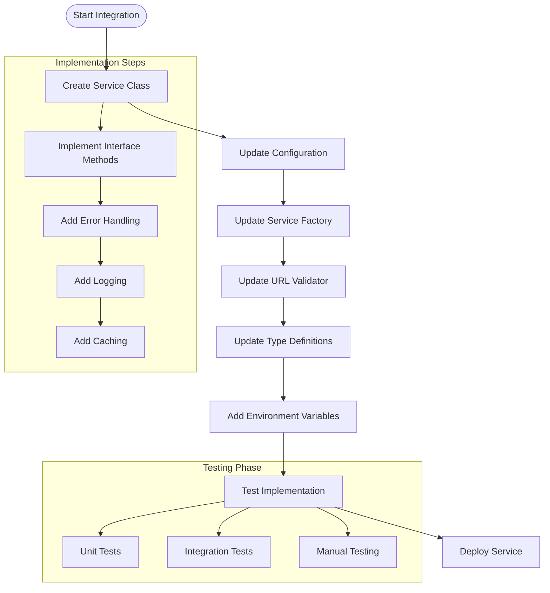

# Adding New Music Services

This guide shows how to integrate new music streaming platforms into Amber while maintaining DRY principles and following the established architecture patterns.

## Overview

Amber's service architecture is designed for easy extension. All music services implement the same interface and follow consistent patterns, making it straightforward to add new platforms.

## Service Interface

All music services must implement the `MusicService` interface:

```typescript
interface MusicService {
  search(query: string): Promise<Song[]>;
  getStreamUrl(song: Song): Promise<string>;
  validateUrl(url: string): boolean;
  getSongFromUrl?(url: string, requestedBy: string): Promise<Song | null>;
}
```

## Integration Process Flow



## Step-by-Step Integration

### 1. Create the Service Class

Create a new file in `src/services/` following the naming convention `[platform]Service.ts`:

```typescript
// src/services/newPlatformService.ts
import { BaseMusicService } from './baseMusicService';
import { Song } from '../types';

export class NewPlatformService extends BaseMusicService {
  constructor() {
    super();
    this.platform = 'newplatform'; // Add to Song.platform union type
  }

  async search(query: string): Promise<Song[]> {
    try {
      this.logger.info(`Searching ${this.platform} for: ${query}`);
      
      // 1. Make API call to platform
      const apiResponse = await this.makeApiCall(query);
      
      // 2. Transform results to Song objects
      const songs = apiResponse.results.map(item => this.createSong({
        title: item.title,
        artist: item.artist,
        duration: item.duration,
        url: item.url,
        thumbnail: item.thumbnail,
        platform: this.platform
      }));
      
      this.logger.info(`Found ${songs.length} songs on ${this.platform}`);
      return songs;
      
    } catch (error) {
      this.logger.error(`Error searching ${this.platform}:`, error);
      throw error;
    }
  }

  async getStreamUrl(song: Song): Promise<string> {
    try {
      this.logger.info(`Getting stream URL for: ${song.title}`);
      
      // Extract stream URL from platform
      const streamUrl = await this.extractStreamUrl(song.url);
      
      if (!streamUrl) {
        throw new Error(`No stream URL found for ${song.title}`);
      }
      
      return streamUrl;
      
    } catch (error) {
      this.logger.error(`Error getting stream URL:`, error);
      throw error;
    }
  }

  validateUrl(url: string): boolean {
    const patterns = [
      /^https?:\/\/(www\.)?newplatform\.com\/track\/[\w-]+/,
      /^https?:\/\/(www\.)?newplatform\.com\/playlist\/[\w-]+/,
      // Add more URL patterns as needed
    ];
    
    return patterns.some(pattern => pattern.test(url));
  }

  async getSongFromUrl(url: string, requestedBy: string): Promise<Song | null> {
    try {
      if (!this.validateUrl(url)) {
        return null;
      }
      
      this.logger.info(`Extracting song from URL: ${url}`);
      
      // Extract song data from URL
      const songData = await this.extractSongFromUrl(url);
      
      if (!songData) {
        return null;
      }
      
      return this.createSong({
        title: songData.title,
        artist: songData.artist,
        duration: songData.duration,
        url: url,
        thumbnail: songData.thumbnail,
        platform: this.platform,
        requestedBy: requestedBy
      });
      
    } catch (error) {
      this.logger.error(`Error extracting song from URL:`, error);
      return null;
    }
  }

  private async makeApiCall(query: string): Promise<any> {
    // Implement platform-specific API call
    const apiKey = this.config.newplatform?.apiKey;
    if (!apiKey) {
      throw new Error('NewPlatform API key not configured');
    }
    
    // Make HTTP request to platform API
    // Return parsed response
  }

  private async extractStreamUrl(url: string): Promise<string | null> {
    // Implement platform-specific stream extraction
    // Return playable stream URL
  }

  private async extractSongFromUrl(url: string): Promise<any> {
    // Implement platform-specific URL parsing
    // Return song metadata
  }
}
```

### 2. Update Configuration

Add configuration options for the new platform:

```typescript
// src/utils/config.ts
export const config = {
  // ... existing config
  newplatform: {
    apiKey: process.env.NEWPLATFORM_API_KEY,
    clientId: process.env.NEWPLATFORM_CLIENT_ID,
    clientSecret: process.env.NEWPLATFORM_CLIENT_SECRET,
  },
};
```

### 3. Update Service Factory

Add the new service to the factory:

```typescript
// src/services/serviceFactory.ts
import { NewPlatformService } from './newPlatformService';

export class ServiceFactory {
  private static newPlatformService: NewPlatformService;

  static getNewPlatformService(): NewPlatformService {
    if (!this.newPlatformService) {
      this.newPlatformService = new NewPlatformService();
    }
    return this.newPlatformService;
  }

  static getAllServices(): MusicService[] {
    return [
      this.getYouTubeService(),
      this.getSpotifyService(),
      this.getSoundCloudService(),
      this.getNewPlatformService(), // Add here
    ];
  }
}
```

#### Class Relationships

The following diagram illustrates the relationship between the core classes in the music service architecture:


This diagram shows:
- **MusicService Interface**: The contract all services must implement
- **BaseMusicService**: Abstract base class providing common functionality
- **Service Classes**: Concrete implementations extending BaseMusicService
- **ServiceFactory**: Singleton factory managing service instances and providing unified access

### 4. Update URL Validator

Add URL validation for the new platform:

```typescript
// src/utils/urlValidator.ts
export class URLValidator {
  static isValidUrl(url: string): boolean {
    return this.isYouTubeUrl(url) || 
           this.isSpotifyUrl(url) || 
           this.isSoundCloudUrl(url) ||
           this.isNewPlatformUrl(url); // Add here
  }

  static isNewPlatformUrl(url: string): boolean {
    const patterns = [
      /^https?:\/\/(www\.)?newplatform\.com\/track\/[\w-]+/,
      /^https?:\/\/(www\.)?newplatform\.com\/playlist\/[\w-]+/,
    ];
    return patterns.some(pattern => pattern.test(url));
  }

  static getPlatformFromUrl(url: string): string {
    if (this.isYouTubeUrl(url)) return 'youtube';
    if (this.isSpotifyUrl(url)) return 'spotify';
    if (this.isSoundCloudUrl(url)) return 'soundcloud';
    if (this.isNewPlatformUrl(url)) return 'newplatform'; // Add here
    return 'unknown';
  }
}
```

### 5. Update Type Definitions

Add the new platform to the Song type:

```typescript
// src/types/index.ts
export interface Song {
  title: string;
  artist: string;
  duration: number;
  url: string;
  thumbnail?: string;
  platform: 'youtube' | 'spotify' | 'soundcloud' | 'newplatform'; // Add here
  requestedBy: string;
  addedAt: Date;
}
```

### 6. Add Environment Variables

Update your environment configuration:

```env
# .env
NEWPLATFORM_API_KEY=your_api_key_here
NEWPLATFORM_CLIENT_ID=your_client_id_here
NEWPLATFORM_CLIENT_SECRET=your_client_secret_here
```

## Best Practices

### 1. Error Handling

Follow the established error handling patterns:

```typescript
async search(query: string): Promise<Song[]> {
  try {
    // Implementation
  } catch (error) {
    this.logger.error(`Error searching ${this.platform}:`, error);
    throw new Error(`Failed to search ${this.platform}: ${error.message}`);
  }
}
```

### 2. Logging

Use consistent logging throughout your service:

```typescript
this.logger.info(`Searching ${this.platform} for: ${query}`);
this.logger.debug(`API response:`, apiResponse);
this.logger.warn(`Partial results from ${this.platform}`);
this.logger.error(`Error in ${this.platform} service:`, error);
```

### 3. Rate Limiting

Implement rate limiting to respect API limits:

```typescript
private async makeApiCall(query: string): Promise<any> {
  // Check rate limits
  await this.checkRateLimit();
  
  // Make API call
  const response = await fetch(apiUrl, {
    headers: { 'Authorization': `Bearer ${apiKey}` }
  });
  
  // Update rate limit tracking
  this.updateRateLimit(response.headers);
  
  return response.json();
}
```

### 4. Caching

Implement caching for frequently accessed data:

```typescript
private cache = new Map<string, any>();
private cacheTimeout = 5 * 60 * 1000; // 5 minutes

async search(query: string): Promise<Song[]> {
  const cacheKey = `search:${query}`;
  const cached = this.cache.get(cacheKey);
  
  if (cached && Date.now() - cached.timestamp < this.cacheTimeout) {
    return cached.data;
  }
  
  const results = await this.performSearch(query);
  this.cache.set(cacheKey, { data: results, timestamp: Date.now() });
  
  return results;
}
```

## Testing Your Service

### 1. Unit Tests

Create comprehensive unit tests:

```typescript
// src/services/__tests__/newPlatformService.test.ts
import { NewPlatformService } from '../newPlatformService';

describe('NewPlatformService', () => {
  let service: NewPlatformService;

  beforeEach(() => {
    service = new NewPlatformService();
  });

  describe('search', () => {
    it('should return songs for valid query', async () => {
      const songs = await service.search('test query');
      expect(songs).toBeInstanceOf(Array);
      expect(songs.length).toBeGreaterThan(0);
    });

    it('should handle empty results', async () => {
      const songs = await service.search('nonexistent query');
      expect(songs).toEqual([]);
    });
  });

  describe('validateUrl', () => {
    it('should validate correct URLs', () => {
      const validUrl = 'https://newplatform.com/track/test123';
      expect(service.validateUrl(validUrl)).toBe(true);
    });

    it('should reject invalid URLs', () => {
      const invalidUrl = 'https://other-platform.com/track/test123';
      expect(service.validateUrl(invalidUrl)).toBe(false);
    });
  });
});
```

### 2. Integration Tests

Test the service with the factory:

```typescript
// src/services/__tests__/serviceFactory.test.ts
import { ServiceFactory } from '../serviceFactory';

describe('ServiceFactory', () => {
  it('should include new platform service in getAllServices', () => {
    const services = ServiceFactory.getAllServices();
    const newPlatformService = services.find(s => s.platform === 'newplatform');
    expect(newPlatformService).toBeDefined();
  });
});
```

## Common Patterns

### 1. Playlist Support

If your platform supports playlists:

```typescript
async getPlaylistSongs(playlistUrl: string, requestedBy: string): Promise<Song[]> {
  try {
    const playlistData = await this.extractPlaylistData(playlistUrl);
    const songs = await Promise.all(
      playlistData.tracks.map(track => this.createSong({
        title: track.title,
        artist: track.artist,
        duration: track.duration,
        url: track.url,
        thumbnail: track.thumbnail,
        platform: this.platform,
        requestedBy: requestedBy
      }))
    );
    return songs.filter(song => song !== null);
  } catch (error) {
    this.logger.error(`Error getting playlist songs:`, error);
    throw error;
  }
}
```

### 2. Search Filters

Implement search filters for better results:

```typescript
async search(query: string, filters?: SearchFilters): Promise<Song[]> {
  const searchParams = {
    q: query,
    type: filters?.type || 'track',
    limit: filters?.limit || 10,
    market: filters?.market || 'US'
  };
  
  // Apply filters to API call
  const apiResponse = await this.makeApiCall(searchParams);
  return this.processSongs(apiResponse);
}
```

### 3. Quality Selection

Support different audio qualities:

```typescript
async getStreamUrl(song: Song, quality: 'low' | 'medium' | 'high' = 'medium'): Promise<string> {
  const streamOptions = await this.getStreamOptions(song.url);
  
  const qualityMap = {
    low: streamOptions.find(s => s.bitrate <= 96000),
    medium: streamOptions.find(s => s.bitrate <= 128000),
    high: streamOptions.find(s => s.bitrate <= 320000)
  };
  
  return qualityMap[quality]?.url || streamOptions[0]?.url;
}
```

## Troubleshooting

### Common Issues

1. **API Rate Limits**: Implement proper rate limiting and retry logic
2. **Stream URL Expiration**: Cache stream URLs appropriately
3. **Authentication**: Handle token refresh for OAuth services
4. **CORS Issues**: Use server-side APIs, not client-side requests

### Debug Logging

Enable debug logging for your service:

```typescript
this.logger.debug(`API request: ${JSON.stringify(requestParams)}`);
this.logger.debug(`API response: ${JSON.stringify(apiResponse)}`);
```

## Next Steps

After implementing your service:

1. **Test thoroughly** with various queries and URLs
2. **Update documentation** with platform-specific features
3. **Add service to README** with setup instructions
4. **Consider contributing** the service back to the project

Your new music service is now fully integrated and follows Amber's architecture patterns!