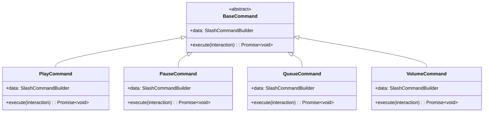
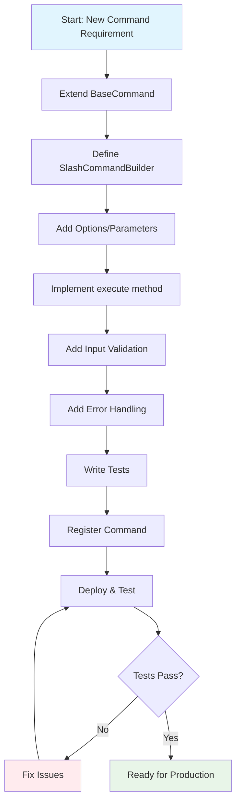
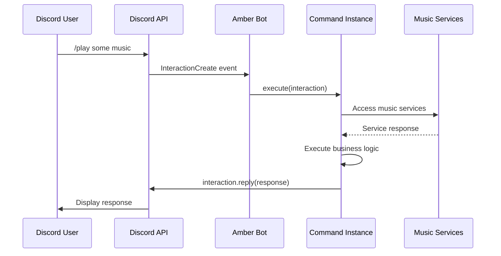

# Creating New Commands

This guide shows how to create new Discord slash commands for Amber following the simple architecture patterns.

## Command Architecture

Amber uses a simple command structure with a base class that provides common functionality:



## Base Class Overview

### BaseCommand
Provides core command functionality:
- Command structure definition
- Abstract execute method
- Basic command interface

## Creating a Basic Command

### 1. Simple Command Example

```typescript
// src/commands/pingCommand.ts
import { BaseCommand } from './baseCommand';
import { ChatInputCommandInteraction, SlashCommandBuilder } from 'discord.js';

export class PingCommand extends BaseCommand {
  get data(): SlashCommandBuilder {
    return new SlashCommandBuilder()
      .setName('ping')
      .setDescription('Check bot response time');
  }

  async execute(interaction: ChatInputCommandInteraction): Promise<void> {
    const sent = await interaction.reply({ 
      content: 'Pinging...', 
      fetchReply: true 
    });
    
    const latency = sent.createdTimestamp - interaction.createdTimestamp;
    
    await interaction.editReply(
      `🏓 Pong! Latency: ${latency}ms | API: ${Math.round(interaction.client.ws.ping)}ms`
    );
  }
}
```

### 2. Command with Options

```typescript
// src/commands/sayCommand.ts
import { BaseCommand } from './baseCommand';
import { ChatInputCommandInteraction, SlashCommandBuilder } from 'discord.js';

export class SayCommand extends BaseCommand {
  get data(): SlashCommandBuilder {
    return new SlashCommandBuilder()
      .setName('say')
      .setDescription('Make the bot say something')
      .addStringOption(option =>
        option.setName('message')
          .setDescription('Message to say')
          .setRequired(true)
          .setMaxLength(1000)
      );
  }

  async execute(interaction: ChatInputCommandInteraction): Promise<void> {
    const message = interaction.options.getString('message', true);
    
    // Input validation
    if (message.length > 1000) {
      await interaction.reply({
        content: '❌ Message too long! Maximum 1000 characters.',
        ephemeral: true
      });
      return;
    }
    
    await interaction.reply({
      content: message
    });
  }
}
```

## Current Command Structure

The bot currently has 9 commands in `/src/commands/`:

1. **baseCommand.ts** - Base command class
2. **play.ts** - Play music from URL or search
3. **pause.ts** - Pause current playback
4. **resume.ts** - Resume paused playback
5. **stop.ts** - Stop playback and clear queue
6. **skip.ts** - Skip to next song
7. **volume.ts** - Adjust volume level
8. **queue.ts** - Display current queue
9. **nowplaying.ts** - Show current song info

## Command Creation Workflow



## Command Registration

### 1. Register Your Command

Add your command to the command registry:

```typescript
// Add to command registration system
// (Exact implementation depends on your commandRegistry.ts structure)
```

### 2. Command Execution Flow



## Best Practices

### 1. Error Handling

Always handle errors gracefully:

```typescript
async execute(interaction: ChatInputCommandInteraction): Promise<void> {
  try {
    // Your command logic
  } catch (error) {
    await interaction.reply({
      content: '❌ An error occurred. Please try again.',
      ephemeral: true
    });
  }
}
```

### 2. Input Validation

Validate all user inputs:

```typescript
// Check required parameters
const query = interaction.options.getString('query', true);
if (!query.trim()) {
  await interaction.reply({
    content: '❌ Please provide a search query.',
    ephemeral: true
  });
  return;
}

// Validate ranges
const volume = interaction.options.getInteger('volume', true);
if (volume < 0 || volume > 100) {
  await interaction.reply({
    content: '❌ Volume must be between 0 and 100.',
    ephemeral: true
  });
  return;
}
```

### 3. Guild Context

Check if command is used in a guild when necessary:

```typescript
const guildId = interaction.guild?.id;
if (!guildId) {
  await interaction.reply({
    content: '❌ This command can only be used in a server.',
    ephemeral: true
  });
  return;
}
```

### 4. Response Formatting

Use consistent response formatting:

```typescript
// Success messages
await interaction.reply({
  content: `✅ Successfully added **${song.title}** to the queue!`
});

// Error messages
await interaction.reply({
  content: '❌ Failed to add song to queue. Please try again.',
  ephemeral: true
});

// Info messages
await interaction.reply({
  content: `ℹ️ Currently playing: **${song.title}** by ${song.artist}`
});
```

## Testing Commands

### 1. Unit Tests

```typescript
// src/commands/__tests__/pingCommand.test.ts
import { PingCommand } from '../pingCommand';
import { createMockInteraction } from '../../test/helpers';

describe('PingCommand', () => {
  let command: PingCommand;
  let mockInteraction: any;

  beforeEach(() => {
    command = new PingCommand();
    mockInteraction = createMockInteraction();
  });

  it('should respond with ping information', async () => {
    await command.execute(mockInteraction);
    
    expect(mockInteraction.reply).toHaveBeenCalledWith({
      content: 'Pinging...',
      fetchReply: true
    });
  });
});
```

## Available Command Types

Based on the current codebase, you can create:

1. **Music Commands** - Commands that interact with music services
2. **Utility Commands** - General purpose commands
3. **Queue Commands** - Commands that manage the music queue
4. **Information Commands** - Commands that display information

## Adding New Commands

To add a new command:

1. Create a new file in `/src/commands/`
2. Extend the `BaseCommand` class
3. Implement the required methods
4. Add proper error handling and validation
5. Register the command in the command system
6. Write tests for your command

This simple architecture makes it easy to create new commands while maintaining consistency across the bot.