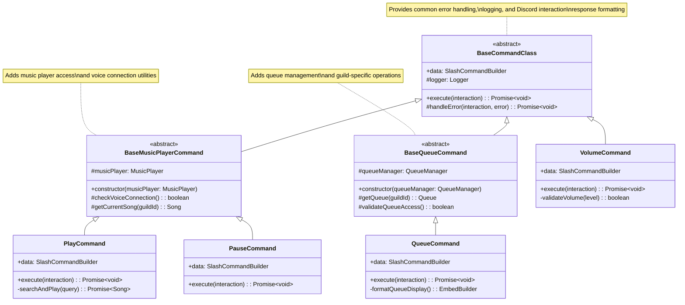
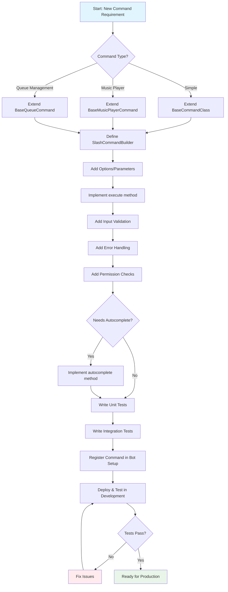
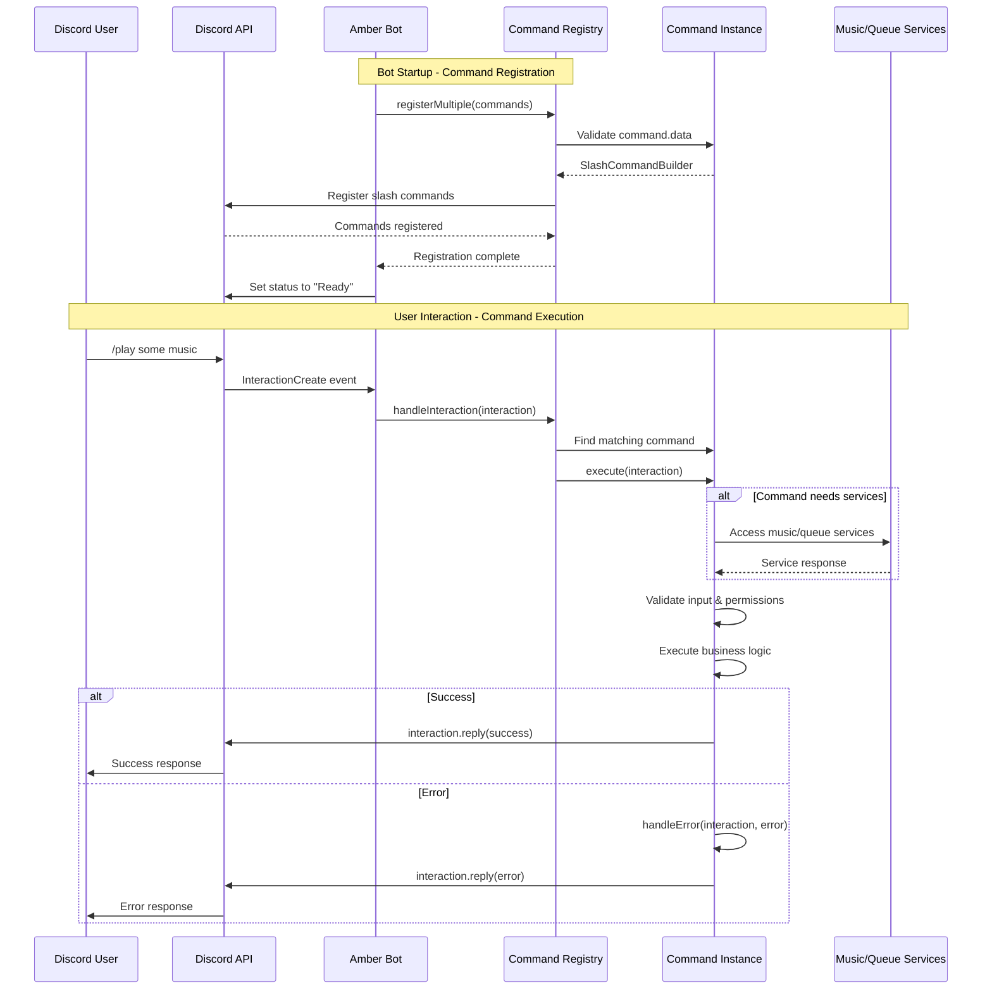
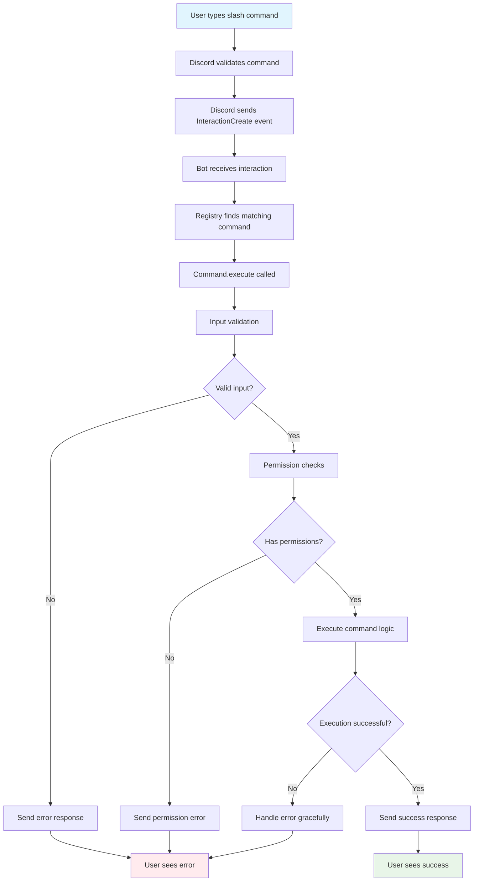
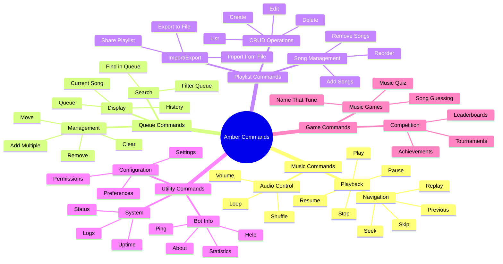
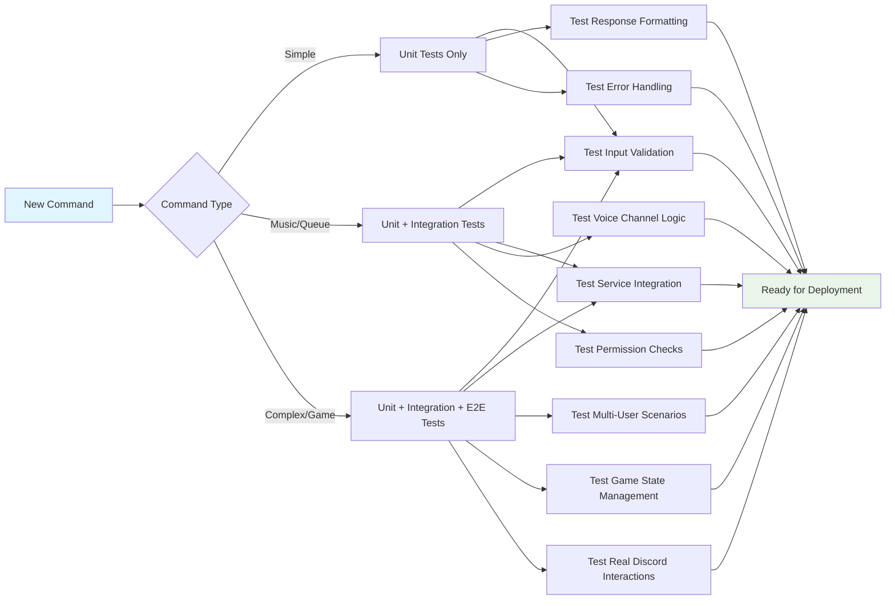

# Creating New Commands

This guide shows how to create new Discord slash commands for Amber while following the established architecture patterns and DRY principles.

## Command Architecture

Amber uses a hierarchical command structure with base classes that provide common functionality:



## Base Classes Overview

### 1. BaseCommandClass
Provides core command functionality:
- Error handling
- Response formatting
- Logging
- Command registration interface

### 2. BaseMusicPlayerCommand
Extends BaseCommandClass for commands that need music player access:
- Music player dependency injection
- Voice connection checks
- Audio-related utilities

### 3. BaseQueueCommand
Extends BaseCommandClass for commands that need queue management:
- Queue manager dependency injection
- Queue validation
- Guild-specific queue access

## Creating a Basic Command

### 1. Simple Command (No Dependencies)

```typescript
// src/commands/pingCommand.ts
import { BaseCommandClass } from './baseCommand';
import { ChatInputCommandInteraction, SlashCommandBuilder } from 'discord.js';

export class PingCommand extends BaseCommandClass {
  get data(): SlashCommandBuilder {
    return new SlashCommandBuilder()
      .setName('ping')
      .setDescription('Check bot response time');
  }

  async execute(interaction: ChatInputCommandInteraction): Promise<void> {
    try {
      const sent = await interaction.reply({ 
        content: 'Pinging...', 
        fetchReply: true 
      });
      
      const latency = sent.createdTimestamp - interaction.createdTimestamp;
      
      await interaction.editReply(
        `🏓 Pong! Latency: ${latency}ms | API: ${Math.round(interaction.client.ws.ping)}ms`
      );
      
    } catch (error) {
      await this.handleError(interaction, error as Error);
    }
  }
}
```

### 2. Command with Options

```typescript
// src/commands/sayCommand.ts
import { BaseCommandClass } from './baseCommand';
import { ChatInputCommandInteraction, SlashCommandBuilder } from 'discord.js';

export class SayCommand extends BaseCommandClass {
  get data(): SlashCommandBuilder {
    return new SlashCommandBuilder()
      .setName('say')
      .setDescription('Make the bot say something')
      .addStringOption(option =>
        option.setName('message')
          .setDescription('Message to say')
          .setRequired(true)
          .setMaxLength(1000)
      )
      .addBooleanOption(option =>
        option.setName('ephemeral')
          .setDescription('Make response only visible to you')
          .setRequired(false)
      );
  }

  async execute(interaction: ChatInputCommandInteraction): Promise<void> {
    try {
      const message = interaction.options.getString('message', true);
      const ephemeral = interaction.options.getBoolean('ephemeral') || false;
      
      // Input validation
      if (message.length > 1000) {
        await interaction.reply({
          content: '❌ Message too long! Maximum 1000 characters.',
          ephemeral: true
        });
        return;
      }
      
      await interaction.reply({
        content: message,
        ephemeral: ephemeral
      });
      
    } catch (error) {
      await this.handleError(interaction, error as Error);
    }
  }
}
```

## Creating Music Player Commands

### 1. Basic Music Player Command

```typescript
// src/commands/seekCommand.ts
import { BaseMusicPlayerCommand } from './baseCommand';
import { ChatInputCommandInteraction, SlashCommandBuilder } from 'discord.js';

export class SeekCommand extends BaseMusicPlayerCommand {
  get data(): SlashCommandBuilder {
    return new SlashCommandBuilder()
      .setName('seek')
      .setDescription('Seek to a specific time in the current song')
      .addStringOption(option =>
        option.setName('time')
          .setDescription('Time to seek to (e.g., 1:30, 90)')
          .setRequired(true)
      );
  }

  async execute(interaction: ChatInputCommandInteraction): Promise<void> {
    try {
      const timeString = interaction.options.getString('time', true);
      const guildId = interaction.guild?.id;
      
      if (!guildId) {
        await interaction.reply({
          content: '❌ This command can only be used in a server.',
          ephemeral: true
        });
        return;
      }
      
      // Parse time string to seconds
      const seconds = this.parseTimeString(timeString);
      if (seconds === null) {
        await interaction.reply({
          content: '❌ Invalid time format. Use format like `1:30` or `90`.',
          ephemeral: true
        });
        return;
      }
      
      // Check if music is playing
      const currentSong = this.musicPlayer.getCurrentSong(guildId);
      if (!currentSong) {
        await interaction.reply({
          content: '❌ No music is currently playing.',
          ephemeral: true
        });
        return;
      }
      
      // Validate seek time
      if (seconds > currentSong.duration) {
        await interaction.reply({
          content: `❌ Cannot seek beyond song duration (${this.formatDuration(currentSong.duration)}).`,
          ephemeral: true
        });
        return;
      }
      
      // Perform seek
      await this.musicPlayer.seek(guildId, seconds);
      
      await interaction.reply({
        content: `⏩ Seeked to ${this.formatDuration(seconds)} in **${currentSong.title}**`
      });
      
    } catch (error) {
      await this.handleError(interaction, error as Error);
    }
  }
  
  private parseTimeString(timeString: string): number | null {
    // Handle formats like "1:30" or "90"
    const timeMatch = timeString.match(/^(?:(\d+):)?(\d+)$/);
    if (!timeMatch) return null;
    
    const minutes = parseInt(timeMatch[1] || '0', 10);
    const seconds = parseInt(timeMatch[2], 10);
    
    return minutes * 60 + seconds;
  }
  
  private formatDuration(seconds: number): string {
    const mins = Math.floor(seconds / 60);
    const secs = seconds % 60;
    return `${mins}:${secs.toString().padStart(2, '0')}`;
  }
}
```

## Creating Queue Commands

### 1. Queue Management Command

```typescript
// src/commands/moveCommand.ts
import { BaseQueueCommand } from './baseCommand';
import { ChatInputCommandInteraction, SlashCommandBuilder } from 'discord.js';

export class MoveCommand extends BaseQueueCommand {
  get data(): SlashCommandBuilder {
    return new SlashCommandBuilder()
      .setName('move')
      .setDescription('Move a song to a different position in the queue')
      .addIntegerOption(option =>
        option.setName('from')
          .setDescription('Current position of the song')
          .setRequired(true)
          .setMinValue(1)
      )
      .addIntegerOption(option =>
        option.setName('to')
          .setDescription('New position for the song')
          .setRequired(true)
          .setMinValue(1)
      );
  }

  async execute(interaction: ChatInputCommandInteraction): Promise<void> {
    try {
      const fromPosition = interaction.options.getInteger('from', true);
      const toPosition = interaction.options.getInteger('to', true);
      const guildId = interaction.guild?.id;
      
      if (!guildId) {
        await interaction.reply({
          content: '❌ This command can only be used in a server.',
          ephemeral: true
        });
        return;
      }
      
      const queue = this.queueManager.getQueue(guildId);
      if (!queue || queue.songs.length === 0) {
        await interaction.reply({
          content: '❌ Queue is empty.',
          ephemeral: true
        });
        return;
      }
      
      // Validate positions
      if (fromPosition > queue.songs.length || toPosition > queue.songs.length) {
        await interaction.reply({
          content: `❌ Invalid position. Queue has ${queue.songs.length} songs.`,
          ephemeral: true
        });
        return;
      }
      
      if (fromPosition === toPosition) {
        await interaction.reply({
          content: '❌ Song is already at that position.',
          ephemeral: true
        });
        return;
      }
      
      // Move the song
      const song = this.queueManager.moveSong(guildId, fromPosition - 1, toPosition - 1);
      
      await interaction.reply({
        content: `✅ Moved **${song.title}** from position ${fromPosition} to ${toPosition}`
      });
      
    } catch (error) {
      await this.handleError(interaction, error as Error);
    }
  }
}
```

## Advanced Command Features

### 1. Subcommands

```typescript
// src/commands/favoriteCommand.ts
import { BaseCommandClass } from './baseCommand';
import { ChatInputCommandInteraction, SlashCommandBuilder } from 'discord.js';

export class FavoriteCommand extends BaseCommandClass {
  get data(): SlashCommandBuilder {
    return new SlashCommandBuilder()
      .setName('favorite')
      .setDescription('Manage your favorite songs')
      .addSubcommand(subcommand =>
        subcommand
          .setName('add')
          .setDescription('Add current song to favorites')
          .addStringOption(option =>
            option.setName('name')
              .setDescription('Name for this favorite')
              .setRequired(true)
          )
      )
      .addSubcommand(subcommand =>
        subcommand
          .setName('remove')
          .setDescription('Remove a favorite song')
          .addStringOption(option =>
            option.setName('name')
              .setDescription('Name of favorite to remove')
              .setRequired(true)
          )
      )
      .addSubcommand(subcommand =>
        subcommand
          .setName('list')
          .setDescription('List your favorite songs')
      )
      .addSubcommand(subcommand =>
        subcommand
          .setName('play')
          .setDescription('Play a favorite song')
          .addStringOption(option =>
            option.setName('name')
              .setDescription('Name of favorite to play')
              .setRequired(true)
          )
      );
  }

  async execute(interaction: ChatInputCommandInteraction): Promise<void> {
    try {
      const subcommand = interaction.options.getSubcommand();
      
      switch (subcommand) {
        case 'add':
          await this.handleAddFavorite(interaction);
          break;
        case 'remove':
          await this.handleRemoveFavorite(interaction);
          break;
        case 'list':
          await this.handleListFavorites(interaction);
          break;
        case 'play':
          await this.handlePlayFavorite(interaction);
          break;
        default:
          await interaction.reply({
            content: '❌ Unknown subcommand.',
            ephemeral: true
          });
      }
      
    } catch (error) {
      await this.handleError(interaction, error as Error);
    }
  }
  
  private async handleAddFavorite(interaction: ChatInputCommandInteraction): Promise<void> {
    // Implementation for adding favorite
  }
  
  private async handleRemoveFavorite(interaction: ChatInputCommandInteraction): Promise<void> {
    // Implementation for removing favorite
  }
  
  private async handleListFavorites(interaction: ChatInputCommandInteraction): Promise<void> {
    // Implementation for listing favorites
  }
  
  private async handlePlayFavorite(interaction: ChatInputCommandInteraction): Promise<void> {
    // Implementation for playing favorite
  }
}
```

### 2. Autocomplete Support

```typescript
// src/commands/favoriteCommand.ts (continued)
export class FavoriteCommand extends BaseCommandClass {
  // ... previous code ...
  
  async autocomplete(interaction: AutocompleteInteraction): Promise<void> {
    try {
      const focusedOption = interaction.options.getFocused(true);
      
      if (focusedOption.name === 'name') {
        const userId = interaction.user.id;
        const favorites = await this.getFavorites(userId);
        
        const filtered = favorites.filter(favorite =>
          favorite.name.toLowerCase().includes(focusedOption.value.toLowerCase())
        );
        
        const choices = filtered.slice(0, 25).map(favorite => ({
          name: `${favorite.name} - ${favorite.title}`,
          value: favorite.name
        }));
        
        await interaction.respond(choices);
      }
      
    } catch (error) {
      console.error('Error in autocomplete:', error);
    }
  }
}
```

## Command Creation Workflow

When creating a new command, follow this systematic approach:



## Command Registration

### 1. Register Your Command

Add your command to the bot's setup:

```typescript
// src/index.ts (in AmberBot class)
private setupCommands(): void {
  const commands = [
    // Existing commands
    new PlayCommand(this.queueManager, this.musicPlayer),
    new PauseCommand(this.musicPlayer),
    new QueueCommand(this.queueManager),
    
    // Add your new commands here
    new PingCommand(),
    new SayCommand(),
    new SeekCommand(this.musicPlayer),
    new MoveCommand(this.queueManager),
    new FavoriteCommand(),
  ];

  this.commandRegistry.registerMultiple(commands);
}
```

### Command Registration and Execution Flow

The following sequence diagram shows how commands are registered during bot startup and then executed when users interact with them:



### 3. Command Execution Lifecycle

Here's how a command moves through its lifecycle from user input to response:



### 2. Handle Autocomplete (if applicable)

```typescript
// src/index.ts (in AmberBot class)
private setupEventHandlers(): void {
  this.client.on('interactionCreate', async (interaction) => {
    if (interaction.isAutocomplete()) {
      try {
        await this.commandRegistry.handleAutocomplete(interaction);
      } catch (error) {
        console.error('Error handling autocomplete:', error);
      }
    }
  });
}
```

## Best Practices

### 1. Error Handling

Always use try-catch blocks and the base class error handler:

```typescript
async execute(interaction: ChatInputCommandInteraction): Promise<void> {
  try {
    // Your command logic
  } catch (error) {
    await this.handleError(interaction, error as Error);
  }
}
```

### 2. Input Validation

Validate all user inputs:

```typescript
// Check required parameters
const query = interaction.options.getString('query', true);
if (!query.trim()) {
  await interaction.reply({
    content: '❌ Please provide a search query.',
    ephemeral: true
  });
  return;
}

// Validate ranges
const volume = interaction.options.getInteger('volume', true);
if (volume < 0 || volume > 100) {
  await interaction.reply({
    content: '❌ Volume must be between 0 and 100.',
    ephemeral: true
  });
  return;
}
```

### 3. Guild Context

Check if command is used in a guild when necessary:

```typescript
const guildId = interaction.guild?.id;
if (!guildId) {
  await interaction.reply({
    content: '❌ This command can only be used in a server.',
    ephemeral: true
  });
  return;
}
```

### 4. Permission Checks

Implement permission checks for sensitive commands:

```typescript
// Check if user has specific permissions
if (!interaction.memberPermissions?.has('MANAGE_GUILD')) {
  await interaction.reply({
    content: '❌ You need Manage Server permission to use this command.',
    ephemeral: true
  });
  return;
}

// Check if user is in voice channel (for music commands)
const member = interaction.member as GuildMember;
if (!member.voice.channel) {
  await interaction.reply({
    content: '❌ You must be in a voice channel to use this command.',
    ephemeral: true
  });
  return;
}
```

### 5. Response Formatting

Use consistent response formatting:

```typescript
// Success messages
await interaction.reply({
  content: `✅ Successfully added **${song.title}** to the queue!`
});

// Error messages
await interaction.reply({
  content: '❌ Failed to add song to queue. Please try again.',
  ephemeral: true
});

// Info messages
await interaction.reply({
  content: `ℹ️ Currently playing: **${song.title}** by ${song.artist}`
});
```

## Testing Commands

### 1. Unit Tests

```typescript
// src/commands/__tests__/pingCommand.test.ts
import { PingCommand } from '../pingCommand';
import { createMockInteraction } from '../../test/helpers';

describe('PingCommand', () => {
  let command: PingCommand;
  let mockInteraction: any;

  beforeEach(() => {
    command = new PingCommand();
    mockInteraction = createMockInteraction();
  });

  it('should respond with ping information', async () => {
    await command.execute(mockInteraction);
    
    expect(mockInteraction.reply).toHaveBeenCalledWith({
      content: 'Pinging...',
      fetchReply: true
    });
  });
});
```

### 2. Integration Tests

```typescript
// src/commands/__tests__/integration/seekCommand.test.ts
import { SeekCommand } from '../seekCommand';
import { createTestMusicPlayer } from '../../test/helpers';

describe('SeekCommand Integration', () => {
  let command: SeekCommand;
  let mockMusicPlayer: any;

  beforeEach(() => {
    mockMusicPlayer = createTestMusicPlayer();
    command = new SeekCommand(mockMusicPlayer);
  });

  it('should seek to specified time', async () => {
    // Setup test with playing song
    mockMusicPlayer.getCurrentSong.mockReturnValue({
      title: 'Test Song',
      duration: 180
    });

    const mockInteraction = createMockInteraction({
      options: {
        getString: jest.fn().mockReturnValue('1:30')
      }
    });

    await command.execute(mockInteraction);

    expect(mockMusicPlayer.seek).toHaveBeenCalledWith('guild123', 90);
  });
});
```

## Command Categories

Amber organizes commands into logical categories based on their functionality and dependencies:



### Command Category Details

#### 1. Music Commands
- **Playback**: Play, pause, resume, stop
- **Navigation**: Skip, previous, replay
- **Audio Control**: Volume, seek, loop

#### 2. Queue Commands
- **Display**: Queue display, current song, history
- **Management**: Clear, shuffle, move, remove, add multiple
- **Search**: Search within queue

#### 3. Playlist Commands
- **CRUD**: Create, delete, edit playlists
- **Management**: Add/remove songs from playlists
- **Import/Export**: Import/export playlists

#### 4. Utility Commands
- **Information**: Ping, help, about
- **Configuration**: Settings, preferences
- **System**: Statistics, uptime

#### 5. Game Commands
- **Music Games**: Music quizzes, trivia
- **Competition**: Song guessing games
- **Social**: Leaderboards

## Testing Strategy

Here's the recommended testing approach for different command types:



Your new commands are now ready to be integrated into Amber's command system!